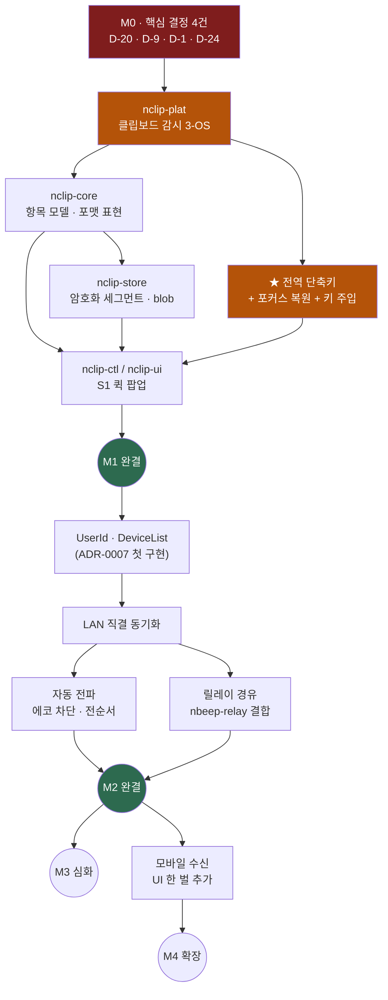

# 02 · 로드맵 — 기능별 개발 진행 목표

> **역할**: [00 비전](00-vision.md)의 **핵심 편의성 8**과 [04](04-feature-scope-and-screens.md)의 **FR 목록**을,
> **"어느 기능을 어느 단계에서 어디까지"** 로 잇는다. 시간 계획이 아니라 **성숙도 계획**이다.
> 작업 단위 백로그는 [TODO](TODO.md), 상태는 [MILESTONES](MILESTONES.md).
>
> 작성 2026-08-25.

---

## 1. 원칙 — 단계마다 **쓸 수 있는 제품**이어야 한다

| # | 원칙 |
|:--:|---|
| **R-1** | ★ **각 단계는 그 자체로 완결된 제품**이다. M1만으로 Maccy를 대체할 수 있어야 하고, M2가 없어도 M1은 매일 쓰인다 |
| **R-2** | **수직 슬라이스로 자른다** — "캡처 계층 전부"가 아니라 "텍스트 복사 → 목록 → 붙여넣기"가 한 단위 |
| **R-3** | ★ **[00 §2](00-vision.md#2--핵심-편의성-8--기능이-아니라-성질)의 편의성 ①~⑦은 M1에서 전부 충족**한다. 이건 나중에 붙이는 것이 아니라 **처음부터의 성질**이다 |
| **R-4** | **정직한 축소** — 못 하는 환경(Wayland/GNOME, mac 권한 없음)은 **조용히 실패하지 않고 표시**한다 |
| **R-5** | 예산 게이트는 **M1부터 CI에 건다.** 나중에 재려면 이미 늦다 |

---

## 2. 단계 정의

| 단계 | 이름 | 한 줄 | 성공 판정 |
|:--:|---|---|---|
| **M0** | 설계·결정 | 무엇을 만들지 확정 | 열린 결정 34건 소화 · ADR 승격 |
| **M1** | **로컬 완결** | 혼자 쓰는 클립보드 매니저 | ★ **macOS에서 Maccy를 지운다** |
| **M2** | ★ **기기 연결 — 제품 완성** | 내 PC들이 하나처럼 | ★ **Windows에서 CopyQ를 지운다** · *"저쪽에 있는데"* 가 사라진다. ⚠️ *정정 08-26*: [DR-19](10-decision-record.md)로 **선택 확장이 아니라 핵심 기능** — M1은 그 앞단계다 |
| **M3** | **심화** | 깊이 있는 도구로 | 변환·보드·OCR로 CopyQ 기능 깊이를 넘어선다 |
| **M4** | **확장** | 모바일·공유·오프라인 | 폰에서 받아 쓴다 |

---

## 3. ★ 기능별 진행 목표 (매트릭스)

> 각 칸 = **그 단계에서 도달할 상태**. `—` = 해당 단계에서 손대지 않음.

| 기능 영역 | **M1 로컬 완결** | **M2 기기 연결** | **M3 심화** | **M4 확장** |
|---|---|---|---|---|
| **캡처** | 텍스트 · **이미지** · **파일 경로** · **HTML/RTF** · ★ **원본 포맷 원문**(Office/GVML) · 중복 병합 · 일시정지 | 변화 없음 | 스마트 감지(전화·이메일·주소) | — |
| **보관** | 영속 · 개수/기간/용량 상한 · **고정** · 삭제/비우기 · **표현별 차등 수명** | 항목에 `origin`·전순서 추가 | **그룹·보드** · 태그 · 스니펫 | 백업·내보내기 |
| **검색** | ★ **타입어헤드 즉시 필터** · **한글 조합 중 검색** · 타입 필터 · **정규식**(메인창) | 기기 필터 | 출처·기간 필터 · 저장 검색 | — |
| **붙여넣기** | ★ **자동 붙여넣기** · **평문으로** · 번호 단축키 · **원본 그대로** | 받은 항목도 동일 | **서식만 제거** · **표현 선택** · 다중 결합 · 타입별 액션 | 스택/순차 |
| **변환** | — | — | 공백·대소문자 · **정규식 치환 규칙** · **로컬 OCR**(D-7) | 이미지 변환 |
| **보안**(DR-20 — 네트워크 ≫ 로컬) | ★ **민감 표식 존중** · 제외 앱 · 무해화 · 외부 전송 0 | ★★ **전송 E2E · 기기 인증 · 봉투 원리** · 기기 폐기 | 패턴 제외 · 자동 만료 · **앱 잠금** | 생체 잠금 |
| **동기화**(★ 핵심 · DR-19) | ✕ 없음(M1은 앞단계) | ★ **UserId 기기 자동 연동** · **LAN 직결** · **릴레이 경유** · **자동 전파**(에코 차단·되돌리기) | 신뢰 기기와 **공유**(수동·보드) | **모바일 수신** · 오프라인 큐 |
| **화면·UX** | ★ **S1 퀵 팝업** · ★ **S2 메인창**(메뉴바+툴바+검색바+**3보기**) · ★ **S6 트레이 최근 5~10개** · S3 설정 · S7 온보딩 · 미리보기 패널 | 기기 배지 · 전파 토스트 · 페어링 화면 | S4 항목 편집 · S5 스니펫 · 보드 UI | 모바일 UI(별도 한 벌) |
| **플랫폼** | Win · mac · Linux(X11/Wayland) · 트레이 · 전역 단축키 · 자동시작 · **다크·고DPI·다국어** | 발견(mDNS) · 릴레이 클라이언트 | CLI 제어 | Android · iOS |
| **배포** | 3-OS 바이너리 · 포터블 · CI 예산 게이트 | — | 패키지 채널 | 스토어 |

---

## 4. 영역별 상세 — 수용 기준 (측정 가능해야 한다)

### 4-1. M1 — 로컬 완결

> ★ **M1의 목표는 기능 개수가 아니라 [00 §2](00-vision.md#2--핵심-편의성-8--기능이-아니라-성질)의 성질 ①~⑦이다.**

| 편의성 | 수용 기준 | 관련 FR |
|---|---|---|
| ① 3초 | 단축키→팝업 **≤100ms** · 검색 갱신 **≤16ms** · 1만 항목에서도 동일 | FR-F-1 · FR-U-10 |
| ② 키보드 완결 | **마우스 없이** 검색·선택·평문 붙여넣기·고정·삭제·편집 전부 가능 | FR-F-7 |
| ③ 잊게 하는 상주 | 유휴 CPU **0%** · 유휴 RSS **CI 게이트 통과** · 단일 실행 파일 | DR-9 |
| ④ 눈으로 골라내기 | 타입 아이콘 + 요약 + 출처 + 시각 + **미리보기 패널** | FR-C-7 |
| ⑤ 알아서 안전 | 1Password·KeePass 등에서 복사한 것이 **기록에 안 남는다**(실기 확인) | FR-S-1·2 |
| ⑥ 되돌아간다 | 삭제 복구 · 전체 비우기 확인 | FR-H-7 |
| ⑦ 맥락 유지 | 붙여넣기 후 **원래 창에 포커스**가 그대로 | FR-P-2 |

**기능 수용 기준**

| 항목 | 기준 |
|---|---|
| **포맷 왕복** | ★ **PPT 도형 복사 → 우리 목록 경유 → PPT에 붙여넣기 = 도형 그대로**(그림으로 안 떨어짐) · Excel 범위 = 수식 유지 · Word 표 = 표 유지 |
| **보기 모드** | ★ 일반/간략/한 줄 3모드가 `Ctrl+1·2·3`으로 **즉시 전환** · 1만 항목에서도 **가변 행 높이 가상화**가 끊기지 않음 |
| **트레이 최근 항목** | 우클릭 → 최근 8개가 **한 번에 보이고**, 클릭 = 클립보드, `Shift`+클릭 = 평문 |
| **리치텍스트 렌더** | 일반 보기에서 표·굵기·색이 보이되 ★ **스크립트·외부 리소스 로드 0**(FR-U-16) |
| **평문 붙여넣기** | Word에서 복사 → `Shift+Enter` → 메모장에 서식 없이 |
| 파일 캡처 | 탐색기/Finder에서 파일 3개 복사 → 목록에 남고 → 다시 붙여넣기 가능 |
| 이미지 | 스크린샷 복사 → 썸네일 표시 → 붙여넣기 원본 유지 |
| 영속 | 재부팅 후 목록·고정 유지 |
| 3-OS 동일 | ★ **스크린샷으로 OS를 구분할 수 없다** |
| Wayland/GNOME | **실행되고, "이 환경에서는 수집 불가"를 명시**(조용한 빈 목록 금지) |
| mac 권한 없음 | 자동 붙여넣기 → **클립보드 복사로 정직하게 강등** + 안내 |

### 4-2. M2 — 기기 연결

| 항목 | 기준 |
|---|---|
| **페어링** | 같은 LAN: 새 기기 실행 → 목록에서 선택 → **6자리 대조** → 승인. **입력값 0** · **≤10초** |
| 원격 페어링 | 핸들 + 패스프레이즈 두 줄 입력 → 대조 → 승인. **≤30초** |
| **LAN 전파 지연** | 복사 → 상대 PC 목록 반영 **≤300ms**(체감상 "이미 있다") |
| 원격 전파 | 텍스트 즉시 · **이미지는 메타 먼저 + 지연 가져오기** |
| **에코 루프** | 24시간 양방향 사용에서 **중복 항목 0** |
| **덮어쓰기 안전** | 덮어쓰기 전 원본이 **기록 두 번째에** 남고 되돌리기 동작 |
| 파일 목록 | 경로 실재 확인 → **파일 객체 또는 텍스트**로 적응 + UI 표시 |
| 오프라인 | 상대 꺼짐 → **"원본 기기 오프라인"** 명시(조용한 실패 금지) |
| 보안 | 서버는 **RID·바이트 수·시각만** 본다(설계 검증) · 폐기 기기는 즉시 수신 중단 |

### 4-3. M3 — 심화

| 항목 | 기준 |
|---|---|
| 변환 규칙 | 정규식 치환 규칙 저장·적용 · 순서 조정 |
| **로컬 OCR**(D-7) | 이미지에서 텍스트 추출 — ★ **로컬로만**(외부 전송 0) |
| 보드 | 작업 맥락별 묶음 · 드래그 이동 |
| 항목 편집 | 편집 후 붙여넣기 |
| CLI | 목록·복사·붙여넣기 스크립트 제어 |

### 4-4. M4 — 확장

| 항목 | 기준 |
|---|---|
| 모바일 수신 | 받은 항목 목록 + **탭하면 로컬 클립보드에 복사** |
| 모바일 발신 | 공유 시트로 수동 전송 |
| 신뢰 기기 공유 | 기본 무전파 · 명시 전송 또는 보드 옵트인 |
| 오프라인 큐 | 꺼진 기기가 나중에 받아 감(컨텐츠 서버 선행 설계 필요) |

---

## 5. 의존 순서 — 무엇이 무엇을 막나

> ★ **주황색 둘이 이 프로젝트의 실제 난이도다** — 나머지는 3타깃 공통 코드다.

---

## 6. 각 단계의 "완료" 정의 (DoD)

| 단계 | 완료 조건 |
|---|---|
| **M0** | 🔴 결정 소화 → DR 표 이동 · ADR 승격(D-1·D-20·D-24) · 요구사항 문서 · **예산 수치 확정** |
| **M1** | [§4-1](#4-1-m1--로컬-완결) 전 항목 통과 · 3타깃 CI green · **예산 게이트 통과** · 실기 QA(3-OS) |
| **M2** | [§4-2](#4-2-m2--기기-연결) 전 항목 통과 · **실기 2대 이상**(LAN + 원격 각각) · 24시간 상주 누수 0 |
| **M3** | [§4-3](#4-3-m3--심화) · 변환 규칙 회귀 테스트 |
| **M4** | [§4-4](#4-4-m4--확장) · 모바일 실기 |

---

## 7. 리스크 — 일정을 실제로 흔들 것

| # | 리스크 | 영향 | 완화 |
|:--:|---|---|---|
| **K-1** | ★ **포커스 복원 + 키 주입**이 3-OS에서 각각 다르고 권한이 걸린다 | M1 핵심(편의성 ⑦)이 무너지면 제품이 안 된다 | 가장 먼저 **수직 슬라이스로 스파이크**. 실패 시 정직한 강등 경로 준비 |
| **K-2** | **Wayland 파편화** — 컴포지터마다 프로토콜 지원이 다르다 | Linux 일부에서 캡처 불가 | `plat` 포트로 격리 · 온보딩에서 명시 |
| **K-3** | ★ **Office 원본 포맷이 크고 버전마다 다르다** | 용량·호환 문제 | **해석하지 않고 이름째 보관**(F-1) · 표현별 상한·차등 수명 |
| **K-4** | **ADR-0007을 우리가 먼저 구현**해야 한다(beep도 v2 미구현) | M2 규모 증가 | M2를 **LAN 직결 먼저**로 쪼갠다 — 릴레이 없이도 가치가 나온다 |
| **K-5** | **오프라인 큐 부재** — 릴레이는 파이프다 | 동시 접속 아니면 전파 안 됨 | M2에서는 **동시 접속만** 지원하고 명시. 큐는 M4 |
| **K-6** | 예산 게이트를 나중에 재면 이미 늦다 | 되돌리기 비용 폭증 | **M1 CI부터** 강제(R-5) |

---

## 8. 지금 위치

> **M0 진행 중.** 설계 문서 9건 완료, ★ **병목은 코드가 아니라 결정 34건**이다([10 §2](10-decision-record.md#2-열린-결정-d--색인)).
> 그중 **D-20 · D-9 · D-1 · D-24** 넷이 나머지를 좌우한다 → [TODO T-1~T-4](TODO.md).
