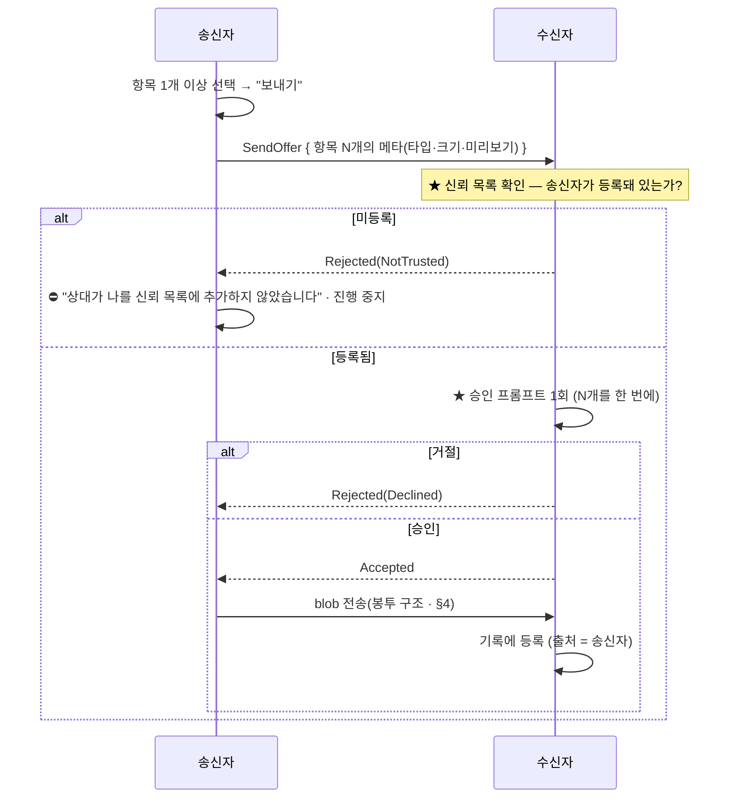
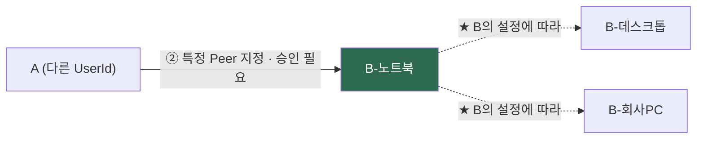

# 05 · 다중 기기 클립보드 공유 — `nexa-beep` 자산 재사용 검토

> **질문(사용자 2026-08-25)**: *"`nexa-beep`를 참조해서 연결된(릴레이 서버·컨텐츠 서버) 다수 장비 간 클립보드 공유 기능을 만들 수 있을까? 별도의 릴레이 서버를 만들어야 하겠지?"*
> **사용자 방향 제시(같은 날)**: *"네트워크를 경유해 전달되는 경우 beep처럼 노출되지 않도록 전달하고, 로컬에서는 해제해서 관리하는 방식으로도 충분한 것 같다."*
>
> **결론 먼저**: **가능하다. 그리고 릴레이 서버는 새로 만들 필요가 없다** — `nexa-beepd`가 이미 있고,
> 릴레이는 **페이로드를 모르므로**(봉투 원리) 클립보드든 메시지든 서버 입장에서 같은 암호문이다.
> ⚠️ **단, 릴레이만으로는 안 된다.** 진짜 필요한 것은 **다중 기기 신원(UserId)** 이고,
> 이건 `nexa-beep`에서도 **아직 v2 미구현**이다([§2](#2-경고--릴레이는-닿는가를-풀지-같은-사람인가를-풀지-않는다)).
>
> 조사일 2026-08-25 · 참조 = `nexa-beep` `docs/32`(ADR-0013 서버 모드) · `docs/20`(ADR-0007 다중 기기) · `crates/nbeep-relay` · `crates/nexa-beepd`.

---

## 1. 재사용할 수 있는 것 — 이미 구현되어 있다

| 자산 | 규모 | 상태 | 클립보드에서의 쓸모 |
|---|---:|---|---|
| **`nbeep-relay`** (와이어 + 클라이언트 어댑터) | **1,769 LOC** | ✅ 구현 | ★ 서버·클라이언트가 **한 크레이트를 공유** — 와이어 어긋남을 컴파일 시점에 잡는다 |
| **`nexa-beepd`** (릴레이 서버 MVP) | **951 LOC** | ✅ 구현 · 별도 배포(`beepd-v*` 태그) | ★ **그대로 재사용 가능** — 아래 [§3](#3-별도-릴레이-서버를-만들어야-하는가--아니다) |
| **회전 RID** `SHA-256("nbeep-rid-v1"‖pubkey‖epoch_day)[..16]` | — | ✅ | 서버에 `PeerId` 원본을 안 준다. 어제·오늘·내일 3개 등록으로 시계 오차 흡수 |
| **경로 사다리** 직접(LAN) → 홀펀칭 → 릴레이 | — | ✅ | ★ 클립보드에 **정확히 맞는다** — 같은 책상 위 2대는 LAN 직결, 집↔회사는 릴레이 |
| **Noise 종단 세션**(`nbeep-crypto`) | — | ✅ | 릴레이는 바이트만 나른다. **핸드셰이크는 A↔B 직접** — 서버는 세션 당사자가 아니다 |
| **`nexa-conf`** 설정 영속 | — | ✅ | beep 의존 0 — 그대로 가져다 쓴다 |

### 1-1. 서버가 보는 것 (봉투 원리 · S-3)

```
[목적지 RID][채널 번호][길이][암호문]
      ↑                    ↑        ↑
  회전 가명            흐름 제어   서버는 못 연다
```

> 서버가 아는 것 = **회전 RID · 채널 번호 · 바이트 수 · 시각**. 그게 전부다.
> **클립보드 내용은 물론 "이게 텍스트인지 이미지인지"도 서버는 모른다.**

---

## 2. ⚠️ 경고 — 릴레이는 "닿는가"를 풀지, "같은 사람인가"를 풀지 않는다

★ **이 함정은 `nexa-beep`가 이미 밟고 문서로 남겨 놨다.** `docs/20`(ADR-0007) §1 첫 줄:

> *"처음 질문은 '릴레이(서버 모드)로 되나'였다. **답은 아니다.**"*

| 벽 | 내용 |
|---|---|
| **① 신원이 기기에 묶여 있다** | `PeerId` = 기기가 최초 실행 시 생성한 정적 공개키. 릴레이는 `Locator`(경로)만 바꾸므로 **PC 2대는 릴레이를 붙여도 여전히 서로 다른 두 노드**다. TOFU의 *"같은 이름, 다른 지문 = 다른 사람"* 에 그대로 걸린다 |
| **② 이력을 보관할 주체가 없다** | 릴레이는 평문을 못 보므로 **구조적으로 서버 보관이 불가능**하다. 게다가 beep의 저장 마스터 키는 **기기 신원 키에서 파생**되어, 기록 파일을 복사해 줘도 **다른 기기가 못 연다** |

> ★ **클립보드 공유는 정확히 "한 사람의 N대 기기"** 다 — 그룹 채팅(내가 남을 묶음)이 아니라
> **내가 나를 묶는** 문제다. 그래서 **ADR-0007의 `UserId` 1:M `PeerId`가 선결 조건**이고,
> **릴레이는 그 위에 얹히는 경로 계층**일 뿐이다.

### 2-1. ADR-0007이 요구하는 것

```
UserId(장기 키) ──서명──► DeviceList {
                             user_pub,
                             devices [ { device_pub, role, caps, added_at } ],
                             revoked [ { device_pub, revoked_at } ],
                             version,     ← 단조 증가(롤백 방지)
                             sig          ← UserId 키의 서명
                          }
```

검증은 **양방향 소유 증명**이다 — `DeviceList` 서명(UserId가 그 기기를 인정) + Noise 핸드셰이크(그 기기가 개인키를 쥠). **둘 다 있어야** 아래가 막힌다.

| 공격 | 막지 못하면 |
|---|---|
| **A-1** 공격자가 자기 `PeerId`를 내 UserId 소속이라 주장 | ★ **내 클립보드가 공격자에게 팬아웃된다** — 읽기 권한을 스스로 부여 |
| **A-2** 남의 기기를 자기 UserId에 끼워 넣음 | 기기 목록 위장·피싱 |
| **A-3** 폐기(도난)된 기기가 옛 서명 목록을 재생 | ★ **지운 노트북이 계속 클립보드를 받는다** |

> ⚠️ **클립보드는 메신저보다 이 공격의 피해가 크다.** 메시지는 내가 보낸 것만 새지만,
> **클립보드는 내가 복사한 모든 것 — 비밀번호 포함 — 이 자동으로 흐른다.**
> A-1이 뚫리면 그건 기능 결함이 아니라 **자격 증명 유출 파이프**다.

### 2-2. 현재 상태 — `nexa-beep`에서도 미구현

| 항목 | beep 상태 |
|---|---|
| 릴레이(모드 ①) | ✅ **MVP 구현**(X-1) |
| **컨텐츠 서버(모드 ②)** | 📐 **Proposed · 미구현** — ADR-0013 자체가 "방향성만"이고 **D-29 사용자 확정 대기** |
| **UserId 다중 기기(ADR-0007)** | ✅ Accepted이나 **v1은 "타입 자리만", 구현은 v2** |

> 👉 **즉 "가져다 쓰면 끝"이 아니다.** 릴레이는 가져다 쓸 수 있고, **다중 기기 신원은 우리가 먼저 구현하게 될 수도 있다.**
> 이건 부담이 아니라 기회다 — **nexa-clip이 ADR-0007의 첫 실구현이 되고, beep이 역으로 가져갈 수 있다.**

---

## 3. "별도 릴레이 서버를 만들어야 하는가?" — **아니다**

### 3-1. 이유 — 릴레이는 페이로드를 모른다

릴레이 서버는 **`[RID][채널][길이][암호문]`** 만 다룬다. 그 암호문이 채팅 메시지인지 클립보드 항목인지 **서버 코드가 알 이유가 없다.** 그래서:

| 선택지 | 내용 | 서버 코드 변경 | 권장 |
|---|---|:--:|:--:|
| **A. `nexa-beepd` 인스턴스 공유** | 이미 돌고 있는 릴레이에 nexa-clip도 붙는다 | **0** | ★★ **1차 권장** |
| **B. `nexa-beepd` 바이너리 재배포** | 같은 서버 프로그램을 clip 전용 인스턴스로 별도 기동(포트만 분리) | **0** | ★ 운영 분리가 필요할 때 |
| **C. 새 릴레이 서버 작성** | clip 전용 프로토콜·서버 | 전부 | ✕ **재발명** |

> **A와 B의 차이는 코드가 아니라 운영**이다. 서버 코드는 어느 쪽이든 **손대지 않는다.**
>
> ⚠️ **같은 서버에 beep 사용자와 clip 사용자가 함께 붙는다.** 섞이지 않게 하는 장치는
> **랑데부 파생의 도메인 분리 + Noise prologue**이고, 이것도 **서버 변경 0**이다
> → [07 §3-4](07-device-rendezvous.md#3-4--애플리케이션-격리--beep과-clip은-서로를-못-본다-사용자-확정-2026-08-26) · [DR-23](10-decision-record.md).

### 3-2. 우리가 가져올 것은 **서버가 아니라 클라이언트 어댑터**

```
nexa-clip/
├─ crates/
│  ├─ nclip-core, nclip-store, nclip-gfx, nclip-ctl, nclip-ui, nclip-plat …
│  └─ nclip-sync        ← ★ 신규: 기기 목록 · 항목 동기화 정책
└─ (외부) nbeep-relay   ← 와이어 + 클라이언트 어댑터를 그대로 참조
   (외부) nexa-beepd    ← 서버는 beep 저장소에 그대로 둔다
```

⚠️ **`nbeep-relay`를 어떻게 참조할 것인가**가 실제 결정 지점이다 → [§7 D-8](#7-열린-결정).

### 3-3. ADR-0013 §9의 교훈 — **한 저장소 + 배포 분리**

beep은 서버를 별도 저장소로 두려다(**DR-9**) 설계를 다 적고 나서 **한 저장소로 바꾸길 권고**했다. 이유는 하나다:

> **"서버 프로젝트에서 실제로 사람을 괴롭히는 건 빌드 시간이 아니라 와이어 포맷 어긋남이다."**
> 실제 사례: `StreamId::Group`을 추가하면서 `recv_any`가 안 따라온 일이 **같은 저장소·같은 CI 안에서도** 났다.
> 저장소가 갈라져 있었으면 몇 주 뒤에나 알았을 것이다.

**가드레일 4개(W-1~W-4)는 nexa-clip에도 그대로 적용한다.**

| # | 가드레일 |
|:--:|---|
| **W-1** | 서버는 **클라이언트 의존 그래프에 절대 안 들어간다** — 방향은 항상 `서버 → 공유 크레이트`, 역참조 금지 |
| **W-2** | **예산 게이트는 클라이언트만 잰다** — 서버 의존이 클라 바이너리 상한을 오염시키면 안 된다 |
| **W-3** | **서버 전용 의존은 서버 크레이트에만** — 공유 크레이트에 서버 편의를 넣지 않는다 |
| **W-4** | **릴리스 태그 분리** — 배포 주기가 다르다 |

---

## 4. ★ 클립보드에 특히 잘 맞는 구조 — "blob 1개 + 봉투 N개"

ADR-0013 §5-9가 그룹 파일 전송용으로 세운 구조인데, **다중 기기 클립보드에 그대로 맞는다.**

```
blob = Enc(K, 항목)              ← K는 그 항목 전용 임의 키. 딱 한 번 암호화
봉투_i = Wrap(기기 i 의 키, K)    ← 32B 남짓 × 기기 수
```

| | 순진한 방식 | 이 구조 |
|---|---|---|
| 5MB 이미지 → 4대 기기 | 기기마다 다른 암호문 → **20MB 업로드** | **5MB × 1** + 봉투 32B × 4 ≈ **5MB** |
| 재배포 | 불가(바이트가 다름) | ★ **이미 받은 기기가 다른 기기에 넘겨줄 수 있다** |
| 서버 | — | ★ **"열쇠 없는 구성원 하나"** — 구조를 안 바꾼다 |

### 4-1. 공짜로 따라오는 이득 — **중복 제거**

`blob_id = H(암호문)` **내용 주소**가 규칙이다. 그런데 **클립보드는 같은 것을 반복해서 복사하는 도구**다.

> 👉 같은 내용을 다시 복사하면 **`blob_id`가 같아 업로드 자체가 생략된다.**
> [04 FR-C-10](04-feature-scope-and-screens.md#1-1-캡처-fr-c--클립보드에서-우리-쪽으로)(중복 감지)이 **동기화 계층에서 한 번 더 배당금을 낸다.**

### 4-2. 안전성 (세 문장)

1. **넘어가는 것은 암호문뿐** — 열쇠 `K`는 그 안에 없다.
2. **봉투는 원 발신 기기만 만든다** — 재배포하는 기기는 열쇠를 나눠 줄 수 없다.
3. **비구성원이 blob을 주워도** `K`가 없어 쓸모없는 바이트다.

---

## 5. 사용자 방향에 대한 검토 — "전송은 봉인, 로컬은 해제"

> 사용자: *"네트워크를 경유해 전달되는 경우 beep처럼 노출되지 않도록 전달하고, 로컬에서는 해제해서 관리하는 방식으로도 충분한 것 같다."*

**전송 구간은 그대로 채택한다** — 이견 없음. 다만 **"로컬에서 해제"에는 두 층이 섞여 있어** 나눠 두어야 한다.

| 층 | 상태 | 판단 |
|---|---|---|
| **메모리에서 평문** | 검색·미리보기·붙여넣기를 하려면 **당연히 필요** | ★ **채택** — 사용자 의도 그대로 |
| **디스크에서 평문** | 기록 파일이 평문으로 눕는다 | ⚠️ **분리해서 결정해야 한다** |

### ⚠️ 디스크까지 평문이면 잃는 것

| 잃는 것 | 내용 |
|---|---|
| **차별점 ②가 사라진다** | [03 §6-2](03-competitive-landscape.md#6-2-nexa-clip의-자리--세-개의-차별점)의 세 차별점 중 하나가 통째로 없어진다 |
| ★ **CopyQ보다 후퇴한다** | 사용자가 지금 Windows에서 쓰는 **CopyQ는 14.0.0부터 내장 at-rest 암호화가 있다**(옵트인). 우리가 평문이면 **현재 환경보다 나빠진다** |
| **동기화가 위험을 키운다** | 기기가 늘면 **평문 사본이 기기 수만큼 늘어난다.** 노트북 분실 1회 = 전 기기 클립보드 이력 유출 |
| 크립토 셰레딩 불가 | 키 폐기로 즉시 삭제하는 수단이 없어진다 |

### 제안 — 세 층으로 나누면 사용자 의도와 안전성이 둘 다 성립한다

| 층 | 방식 | 근거 |
|---|---|---|
| **① 네트워크** | ★ **beep 그대로** — Noise 종단 암호화 · 서버는 봉투만 | 사용자 확정 |
| **② 메모리** | ★ **평문** — 검색·미리보기·붙여넣기 자유롭게 | 사용자 확정 |
| **③ 디스크** | **봉인(기본 켜짐)** — 앱이 열려 있는 동안 자동 해제되므로 **사용자는 차이를 느끼지 않는다** | beep ADR-0005 키 계층이 정확히 이 모양 |

> ★ **핵심**: ③은 **사용자가 무언가를 더 해야 하는 기능이 아니다.** 암호는 기기 키에서 나오고,
> 앱이 켜지면 자동으로 열린다. **"로컬에서 해제해서 관리"는 그대로 성립하고**, 잃는 것은 없으며,
> 얻는 것은 **분실·백업 유출·타 계정 접근에 대한 방어**다.
>
> 🔴 **이건 사용자 결정 사항이다** → [§7 D-9](#7-열린-결정).

---

## 6. 동기화 대상 — 두 축 (사용자 확정 2026-08-25)

> **사용자 확정**: *"`PeerId`는 다르겠지만 `UserId`가 동일한 경우를 자동으로 연동. beep처럼 서로 신뢰하는 경우로 등록한 장치들 간의 동기화도 지원."*

**동기화 대상이 두 축으로 갈린다. 이 둘은 성질이 정반대라 정책도 달라야 한다.**

| 축 | **① 내 기기**(같은 `UserId`) | **② 신뢰한 상대 기기**(다른 `UserId`) |
|---|---|---|
| 판정 근거 | `DeviceList` 서명(ADR-0007) | **TOFU 핀 + SAS 대조**(beep 신뢰 등급) |
| 연동 | ★ **자동** — 목록에 있으면 즉시 | ★ **등록(명시적 승인)** 후에만 |
| 방향 | **양방향 미러링** | **선택 공유**(아래 ⚠️) |
| 비유 | 내 노트북 ↔ 내 데스크톱 | 동료에게 항목을 건네주기 |
| 틀렸을 때 | 내 기기가 하나 더 늘 뿐 | ★ **내 클립보드가 남에게 흐른다** |

### 6-1. ① 내 기기 — 자동 연동

`UserId` 장기 키가 서명한 `DeviceList`에 있고 `revoked`에 없으면 **묻지 않고 붙는다.** 사용자가 기기를 추가하는 행위(= 페어링) 자체가 승인이므로, 매번 다시 물으면 그게 잡음이다.

| 규칙 | 내용 |
|---|---|
| **S-1** | `DeviceList` 서명 검증 + Noise 핸드셰이크 **양방향 소유 증명**을 통과해야 한다([§2-1](#2-1-adr-0007이-요구하는-것)) |
| **S-2** | `version` 단조 증가 검사 — **폐기한 기기의 롤백(A-3)** 을 막는다 |
| **S-3** | 기기 폐기 = **그 기기 앞으로 만든 봉투를 더 이상 만들지 않는다.** 이미 받은 것은 회수 불가(정직하게 표시) |
| **S-4** | 경로는 [§1](#1-재사용할-수-있는-것--이미-구현되어-있다) 사다리 그대로 — **같은 LAN이면 릴레이를 안 탄다** |
| ★ **S-5** | ★ **승인 과정이 없다**([DR-28](10-decision-record.md)) — 한쪽이 복사하면 바로 전송되고, 받는 쪽은 **시스템 클립보드에 즉시 반영 + 알림**한다. 이미 `DeviceList` 서명으로 **기기를 승인해 둔 상태**라 항목마다 다시 묻지 않는다 |
| **S-6** | 안전장치는 승인이 아니라 **원본 보존 + 알림 + 되돌리기**다([08 §4-2](08-clipboard-propagation.md#4-2-어느-모드든-지키는-것) W-1~W-3) |

### 6-2. ② 신뢰한 상대 기기 — ⚠️ 자동 미러링 금지

> ★ **여기서 메신저와 클립보드가 갈라진다.** beep에서 "신뢰한 상대"는 **내가 보낸 것만** 받는다.
> 클립보드를 같은 규칙으로 자동 미러링하면 **내가 복사한 모든 것 — 비밀번호 포함 — 이 상대에게 흐른다.**
> 이건 기능이 아니라 **자격 증명 유출 파이프**다([§2-1](#2-1-adr-0007이-요구하는-것) A-1과 같은 결과를, 이번엔 **설계로** 만들어 주는 셈).

**따라서 ②는 "동기화"가 아니라 "공유"로 설계한다.**

| 규칙 | 내용 |
|---|---|
| **T-1** | ★ **기본은 아무것도 흐르지 않는다.** 항목을 **명시적으로 보낼 때만** 간다(누르는 행위 필요) |
| **T-2** | 자동 흐름을 원하면 **공유 그룹/보드 단위 옵트인** — *"이 보드에 넣은 것만 공유"*([04 FR-H-4](04-feature-scope-and-screens.md#1-2-보관-fr-h) 재사용) |
| **T-3** | **민감 표식·제외 규칙은 공유 경로에서 한 번 더 적용**한다(fail-closed) — 로컬에 저장된 것이라도 **나갈 때 다시 검사** |
| **T-4** | 신뢰 등급이 **SAS 대조 완료** 이상일 때만 공유 대상이 될 수 있다(TOFU 핀만으로는 부족) |
| **T-5** | 받은 항목은 **출처(누가 보냈는지)를 항목에 남긴다** — 내 것과 섞이지 않게 |

> ★ **한 줄**: **내 기기끼리는 동기화(자동·양방향), 남과는 공유(수동·단방향).**
> 같은 전송 계층을 쓰지만 **정책이 반대**다.

### 6-2-1. ★ 클립보드 보내기(Send) — 프로토콜 (사용자 확정 2026-08-26)

> **사용자 확정**: *"클립보드를 보내면 승인을 하면 내 클립보드에 등록, 1개 이상 전송 및 수신 가능. **단일 요청, 단일 승인**. 수신자 입장에서 송신자를 신뢰하는 사용자로 추가한 경우만 동작, 미등록 상태라면 전송이 불가능하다고 메시지가 보이고 진행 중지."*

**`nexa-beep`의 파일 전송과 같은 모양**이다 — 보내는 쪽이 제안하고, **받는 쪽이 승인해야** 실체가 된다.



| # | 규칙 | 근거 |
|:--:|---|---|
| **S-1** | ★ **수신자의 신뢰 목록이 관문이다.** 송신자가 거기 없으면 **아무것도 도달하지 않는다** | 신뢰는 받는 쪽이 정한다([09 §1-1](09-identity-and-pairing.md#1-1-왜-느슨한-이름이-안전한가)) |
| **S-2** | 미등록이면 송신자에게 **"전송 불가"를 명시하고 중지**한다 — 조용히 실패하지 않는다 | 사용자 확정 |
| **S-3** | ★ **단일 요청 = 단일 승인.** N개를 한 번에 보내고 **승인도 한 번** | ★ 승인 피로 방지([14 §2-2](14-settings-registry.md) R-d와 같은 원리) — 항목마다 물으면 습관적으로 누른다 |
| **S-4** | 승인 전에는 **메타(타입·크기·미리보기)만** 간다. 본문은 승인 후 | beep 파일 전송과 동일 — 승인 전 실체를 만들지 않는다 |
| **S-5** | 받은 항목은 **출처를 남긴다**(누가 보냈는지) | 내 것과 섞이지 않게([§6-2](#6-2--신뢰한-상대-기기--️-자동-미러링-금지) T-5) |
| **S-6** | 민감 표식·제외 규칙은 **보낼 때와 받을 때 두 번** 검사 | fail-closed |
| **S-7** | 수신자는 승인 없이도 **언제든 신뢰를 해제**할 수 있고, 해제하면 이후 요청은 S-1에서 막힌다 | 통제권은 받는 쪽 |

#### ⚠️ 짚어 둘 것 — "미등록" 응답이 정보를 흘리지 않는가

*"당신은 내 신뢰 목록에 없다"* 는 응답은 원칙적으로 **존재 확인**에 쓰일 수 있다. 다만 우리 구조에서는
**랑데부 자체가 상대의 키를 이미 알아야 성립**하므로([07 §3-3](07-device-rendezvous.md#3-3-권장안-c--동작)),
모르는 사람은 **애초에 도달하지 못한다**. 따라서 이 응답의 추가 누출은 실질적으로 없다.

> ★ **단, 응답을 "무응답"으로 바꾸지는 않는다.** 사용자 확정이 *"전송이 불가능하다고 메시지가 보이고 진행 중지"* 이고,
> **조용한 실패가 더 나쁘다**([02 R-4](02-roadmap.md#1-원칙--단계마다-쓸-수-있는-제품이어야-한다)).

### 6-2-2. ★ 팬아웃 범위와 승인 정책 (사용자 확정 2026-08-26)

> **사용자 확정**: *"내 기기 간 공유는 **연결된 모든 Peer에 동시 전송**하는 개념. 다른 사람에게 공유는 **특정 Peer에만** 공유. 자기 설정을 통해 **자체 전파하는 경우는 수신측의 결정**."*
> *"나를 신뢰하는 다른 `UserId`의 `PeerId`에 전송하는 경우는 **신뢰관계여도 기본은 수동 승인**. 신뢰하는 사용자 목록에서 **자동 승인 여부를 추가 설정**할 수 있으면 좋겠다."*

#### 범위 — 누구에게 가는가

| | **축 ① 내 기기**(같은 `UserId`) | **축 ② 다른 사람**(다른 `UserId`) |
|---|---|---|
| 대상 | ★ **연결된 모든 Peer에 동시 전송**(브로드캐스트) | ★ **특정 Peer 하나를 골라** 보낸다 |
| 이유 | 내 기기들은 **같은 상태여야 한다** — 어느 걸 켜든 같은 목록이 있어야 편의성 ⑧이 성립 | 남에게 보내는 것은 **의도된 행위**다. "누구에게"가 없으면 성립하지 않는다 |
| UI | 자동(대상 선택 없음) | 대상 선택 → 보내기 |

> 팬아웃 구현은 **[§4](#4--클립보드에-특히-잘-맞는-구조--blob-1개--봉투-n개)의 blob 1개 + 봉투 N개** 그대로다 —
> 원소가 *내 기기 N대*냐 *상대 1대*냐만 다르다.

#### ★ 재전파는 **받는 쪽이 정한다**

B가 A(다른 사용자)에게서 항목을 받았을 때, **그것을 B의 다른 기기들에도 퍼뜨릴지는 B의 설정**이다.



| 규칙 | 내용 |
|---|---|
| **F-1** | ★ **A는 B의 기기 구성을 모르고, 알 필요도 없다** — A가 지정한 것은 **B의 특정 Peer 하나**다 |
| **F-2** | ★ **재전파 여부는 B의 설정**(`sync.relay_received`) — 기본 **끔**. 받은 것이 조용히 내 기기 전체에 퍼지지 않는다 |
| **F-3** | 재전파해도 **출처(A)는 유지**된다 — B의 다른 기기에서도 *"A에게 받음"* 으로 보인다 |

#### 승인 정책 — 신뢰해도 기본은 수동

| 상황 | 승인 |
|---|---|
| **축 ① 내 기기** | ★ **없음** — 즉시 반영 + 알림([DR-28](10-decision-record.md)) |
| **축 ② 다른 사람** | ★ **기본 수동 승인**([DR-22](10-decision-record.md)) — 신뢰 목록에 있어도 항목마다 묻는다 |
| 축 ② + **상대별 자동 승인 켬** | 묻지 않고 받는다 — ★ **신뢰 목록에서 사람마다 따로** 켠다 |

| 규칙 | 내용 |
|---|---|
| **T-8** | ★ **신뢰 = 도달 허가일 뿐, 수신 동의가 아니다.** 그래서 신뢰해도 기본은 묻는다 |
| **T-9** | **자동 승인은 사람 단위**(전역 스위치가 아니다) — 신뢰 목록의 각 행에 토글 |
| **T-10** | 자동 승인이 켜져 있어도 **민감·제외 규칙은 그대로 적용**된다(fail-closed) |
| **T-11** | 자동 승인 상태는 **목록에서 한눈에 보인다** — 켜 둔 것을 잊으면 그게 사고다 |

---

### 6-3. 두 축이 공유하는 것

전송 구조는 [§4](#4--클립보드에-특히-잘-맞는-구조--blob-1개--봉투-n개)의 **blob 1개 + 봉투 N개**가 그대로 덮는다 — 수신자가 *내 기기 N대*냐 *신뢰한 상대*냐만 다르고, 봉투를 만드는 방식은 같다. beep `docs/32 §5-9`가 *"하나의 구조가 셋을 덮는다"* 고 적은 것이 여기서도 성립한다.

---

## 7. 열린 결정

| # | 결정할 것 | 선택지 | 비고 |
|---|---|---|---|
| **D-7** | OCR 텍스트 추출 | 범위 밖 유지 vs 채택 | ⚠️ **사용자가 Maccy에서 실사용 중** — 없으면 후퇴로 느껴진다([03 §5-4-2 U-7](03-competitive-landscape.md#5-4-2-실사용에서-나오는-요구--두-앱을-오갈-때-실제로-겪는-것)) |
| **D-8** | `nbeep-relay` 참조 방식 | ① beep 저장소 path 의존 · ② 크레이트 복사(vendoring) · ③ beep 워크스페이스에 nexa-clip 편입 | ★ ①은 두 저장소 결합, ②는 와이어 어긋남 위험(ADR-0013 §9-1이 경고한 바로 그것), ③은 규모가 커진다 |
| ~~D-9~~ | ~~디스크 at-rest 암호화~~ | — | ✅ **닫힘 → [DR-38](10-decision-record.md)**(08-31 재확정: **기본 켜짐** · 꺼도 기기 키 암호화 유지 · DR-20 로컬 조항 대체) |
| **D-10** | ~~다중 기기 신원 구현 시점~~ | ✅ **닫힘 — [§6](#6-동기화-대상--두-축-사용자-확정-2026-08-25) 사용자 확정.** `UserId` 자동 연동 + 신뢰 기기 등록 공유를 **지원한다** | 남은 것은 *시점*뿐 → **nexa-clip이 ADR-0007의 첫 실구현**이 된다 |
| **D-13** | ②의 공유 단위 | 항목 단건만 vs 공유 보드 vs 둘 다 | [§6-2 T-2](#6-2--신뢰한-상대-기기--️-자동-미러링-금지) |
| **D-11** | 오프라인 큐(꺼진 기기) | 컨텐츠 서버(모드 ②) 필요 — beep에서도 미구현 | 없으면 **양쪽이 동시에 켜져 있어야만** 동기화된다 |
| **D-12** | 동기화 범위 | 전 항목 vs 고정·최근 N개만 vs 수동 선택 | 클립보드는 양이 많다 — **전 항목 동기화는 회선·저장소를 빠르게 태운다** |

---

## 8. 정리 — 단계별 실현 경로

| 단계 | 내용 | 선행 |
|---|---|---|
| **1차(v1)** | **동기화 없음.** 로컬 완결 제품 | — |
| **2차** | ★ **같은 LAN 직결 동기화** — 릴레이도 서버도 필요 없다. beep의 발견 + Noise만으로 성립 | ADR-0007(UserId) |
| **3차** | **릴레이 경유**(집 ↔ 회사) — `nexa-beepd` 그대로 | 2차 + `nbeep-relay` 결합 |
| **4차** | **오프라인 큐** — 컨텐츠 서버(모드 ②) | beep D-29 확정 또는 우리가 선행 구현 |

> ★ **2차가 이 사용자에게 가장 큰 실익**이다 — [03 §5-4-2 U-3](03-competitive-landscape.md#5-4-2-실사용에서-나오는-요구--두-앱을-오갈-때-실제로-겪는-것)("mac에서 복사한 것을 Windows에서 못 꺼낸다")은
> **대부분 같은 책상·같은 LAN에서 발생**한다. 서버 없이 풀리는 문제에 서버를 먼저 붙일 이유가 없다.
