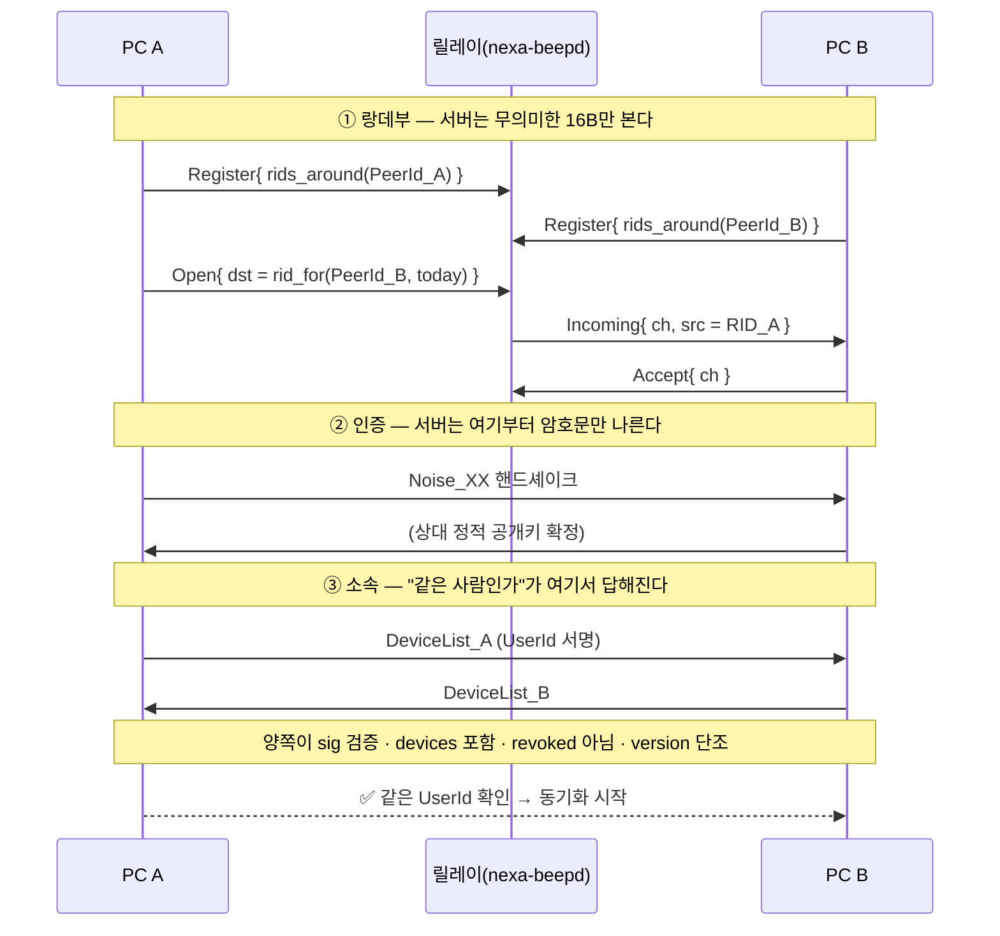

# 07 · 같은 사용자 확인 기법 — 릴레이 랑데부와 기기 인증

> **질문(사용자 2026-08-25)**: *"두 PC에서 릴레이 서버에 동시에 접속했을 때, 같은 사람이(`UserId`) 접속했음을 확인하는 기법은 어떤 게 좋을까?"*
>
> **결론**: ★ **서버는 확인하지 않는다. 확인은 전부 종단(E2E)에서 3단으로 한다.**
> 서버가 하는 일은 **가명 만남 지점 제공**뿐이고, *"같은 사람인가"* 는 **Noise 핸드셰이크 + `DeviceList` 서명 + version 단조성**이 답한다.
> **기기마다 자기 RID를 등록**하고, 상대 RID는 `DeviceList`로 알아낸 상대 `PeerId`에서 계산한다 → ★ **릴레이 서버 코드 변경 0**.
>
> 작성 2026-08-25 · 근거 = `nexa-beep` `crates/nbeep-relay/src/lib.rs` · `crates/nexa-beepd/src/lib.rs` 실코드 확인 · `docs/32`(ADR-0013) · `docs/20`(ADR-0007).

---

## 1. 먼저 못 박을 것 — **서버가 "같은 사람"을 알면 안 된다**

가장 쉬운 답은 *"서버에 UserId로 로그인시키고, 서버가 같은 계정인지 확인한다"* 이다. **이걸 하면 안 된다.**

| 깨지는 것 | 내용 |
|---|---|
| **S-3**(봉투 원리) | 서버가 아는 것은 *회전 RID · 채널 번호 · 바이트 수 · 시각* 이 전부여야 한다 |
| **R-18**(영구 재식별자) | `UserId`를 서버에 주면 **"누가 언제 어디서 접속했는지의 영구 로그"** 가 생긴다. LAN 관찰자는 같은 브로드캐스트 도메인에 있어야 하지만 **릴레이는 전 세계 접속을 한 점에 모은다** |
| 모드 경계 | 릴레이(모드 ①)가 조용히 **관리 서버(모드 ③)** 로 미끄러진다 — ADR-0013이 가장 경계한 것 |

> ★ **판단 기준 한 줄** — *"서버의 봉투에 무엇이 추가되는가? 답이 '신원'이면 설계가 틀린 것이다."*

### 1-1. ⚠️ 쓰면 안 되는 기존 기능 — roster 프레즌스

beep 릴레이에는 **옵트인 공개 목록**이 이미 있다(X-2e).

```rust
C2s::Announce { listed: bool }          // 나를 공개 목록에 싣는다
S2c::PeerUp   { peer: PeerId }          // ★ 공개키 원본이 그대로 실린다
```

**편리해 보이지만 다중 기기에 쓰면 안 된다** — `PeerUp`은 **`PeerId`(공개키) 원본을 서버와 접속 중인 다른 사용자 전원에게 노출**한다. 이건 *"나를 찾아도 좋다"* 고 사용자가 명시적으로 켠 **공개 모드**용이지, **내 기기끼리 만나는 용도가 아니다.**

---

## 2. 3단 구조 — 만남 / 인증 / 소속

```
① 랑데부   서버   "무의미한 16바이트 둘이 만났다"        ← 서버가 아는 전부
② 인증     종단   Noise_XX → 상대 정적 공개키 확정        ← 서버는 못 본다
③ 소속     종단   DeviceList 서명 → 그 키가 내 UserId 것  ← 여기서 "같은 사람"이 증명된다
```

★ **"같은 사람인가"는 ③에서만 답해진다.** ①은 만나게만 하고, ②는 *상대가 그 키의 주인임*만 말한다.

### 2-1. ② 인증 — Noise_XX가 주는 것

핸드셰이크가 성립하면 **상대가 그 정적 개인키를 실제로 쥐고 있음**이 증명된다. 핸드셰이크 자체가 신선도(freshness)를 포함하므로 **별도 challenge-response가 필요 없다** — 재생 공격은 여기서 이미 막힌다.

⚠️ **릴레이는 이 세션의 당사자가 아니다.** 서버는 자기 전송 계층을 벗겨도 **종단 암호문만 남는다.** 이걸 흐리면 릴레이가 MITM이 된다.

### 2-2. ③ 소속 — `DeviceList` 검증이 본체

```
UserId(장기 키) ──서명──► DeviceList {
                             user_pub,
                             devices [ { device_pub, role, caps, added_at } ],
                             revoked [ { device_pub, revoked_at } ],
                             version,      ← 단조 증가
                             sig
                          }
```

**양쪽이 서로를 검증한다**(한쪽만 하면 [05 §2-1](05-multi-device-sharing.md#2-1-adr-0007이-요구하는-것) A-2가 열린다).

| 단계 | 검사 | 막는 것 |
|:--:|---|---|
| 1 | `sig`를 `user_pub`로 검증 | 위조된 목록 |
| 2 | ②에서 확정한 상대 공개키가 `devices`에 **있고** `revoked`에 **없는지** | **A-1** — 공격자가 자기 기기를 내 UserId 소속이라 주장 |
| 3 | `version` ≥ **내가 본 최대값** | **A-3** — 폐기된 기기의 옛 목록 재생(롤백) |
| 4 | 양방향 — 상대도 나에게 같은 검사를 한다 | **A-2** — 남의 기기 끼워 넣기 |

> ★ **양방향 소유 증명이 핵심이다** — `sig`는 *"UserId 키가 이 기기를 인정한다"*, Noise는 *"이 기기가 개인키를 쥐고 있다"*. **둘 다 있어야** 성립한다. 하나만으로는 전부 뚫린다.

#### ⚠️ 정직하게 — 폐기(revocation)는 완전하지 않다

오프라인이던 기기는 최신 `DeviceList`를 못 받았으므로, **폐기된 기기가 "폐기 이전 버전"을 다른 오프라인 기기에게 제시**할 수 있다. `version` 단조성은 *내가 본 것보다 낮은 것*만 막는다.

| 완화 | 내용 |
|---|---|
| 재접속 시 최신 version 수렴 | 온라인이 되는 순간 더 높은 version을 받아 고정된다 |
| ★ **폐기 = 키 로테이션** | 기기를 폐기하면 **공유 비밀·랑데부 파생 재료를 회전**시킨다. 그래야 폐기가 실효를 갖는다 |
| 표시 | 기기 관리 화면에 *"폐기 반영 대기 중인 기기 N대"* 를 **정직하게 보여준다** |

---

## 3. ① 랑데부 ID — 네 가지 안 비교

### 3-1. ★ 결정적 제약 — 서버의 RID 맵은 **1 RID = 1 연결**이다

`nexa-beepd` 실코드:

```rust
rids: Mutex<HashMap<Rid, ConnId>>,     // ← 1:1
…
for r in &rids { map.insert(*r, conn_id); }   // ← 나중 등록이 덮어쓴다
```

> 👉 **같은 RID를 두 기기가 등록하면 뒤에 붙은 기기가 앞의 기기를 지운다.**
> "UserId에서 하나의 공유 랑데부 ID를 파생해 모든 기기가 거기서 만난다"는 매력적인 안이 **현재 서버에서 그냥 깨진다.**

### 3-2. 비교

| 안 | 방식 | 서버가 아는 것 | 현 서버 호환 | 판정 |
|:--:|---|---|:--:|:--:|
| **A** | 서버 계정 인증 — UserId로 로그인 | ★ **신원 전부** | 개조 필요 | ✕ [§1](#1-먼저-못-박을-것--서버가-같은-사람을-알면-안-된다) 위반 |
| **B** | roster 공개 프레즌스(`Announce`/`PeerUp`) | **공개키 원본** | ✅ 그대로 | ✕ 과노출([§1-1](#1-1-️-쓰면-안-되는-기존-기능--roster-프레즌스)) |
| **C** | ★ **기기별 회전 RID + 종단 DeviceList 검증** | 무의미한 16B | ✅ **변경 0** | ★★ **권장** |
| **D** | 공유 URID — `HMAC(S_user, epoch)` 하나에 전 기기 등록 | 무의미한 16B (단 "몇 대가 한 무리") | ✕ **[§3-1](#3-1--결정적-제약--서버의-rid-맵은-1-rid--1-연결이다)에서 깨짐** | △ 서버 개조 시 재검토 |
| **E** | PAKE·PSI 등 고급 프로토콜로 집합 교집합 | 무의미 | ✕ | ✕ 과설계 — 얻는 것 대비 복잡도가 크다 |

### 3-3. 권장안 C — 동작

**beep의 기존 함수를 그대로 쓴다.**

```rust
// 등록: 내 PeerId로 어제·오늘·내일 3개 (시계 오차 흡수)
C2s::Register { rids: rids_around(&my_peer_id).to_vec() }

// 상대 찾기: DeviceList에서 얻은 상대 PeerId로 계산
C2s::Open { token, dst: rid_for(&peer_b, current_epoch_day()) }
```

`RID = SHA-256("nbeep-rid-v1" ‖ 공개키 ‖ epoch_day)[..16]`

| 성질 | 내용 |
|---|---|
| **회전** | 에폭(UTC 일)마다 바뀐다 → 서버는 **어제의 그 연결과 오늘의 이것이 같은 기기인지 모른다** |
| **계산 가능성** | ★ **내 공개키를 이미 아는 쪽만** 내 RID를 계산할 수 있다 — 내 기기들은 `DeviceList`로 서로의 공개키를 안다 |
| **스팸 방어** | 모르는 사람은 애초에 내 RID를 만들 수 없다(R-4) |
| **서버 변경** | **0** — [05 §3](05-multi-device-sharing.md#3-별도-릴레이-서버를-만들어야-하는가--아니다) 결론과 정합 |

> ★ **"상대가 이미 내 키를 아는 사람만 나를 찾는다"는 제약이 아니라 정확히 옳은 성질이다.**
> 릴레이는 **새로운 만남을 주선하지 않는다.** 만남(페어링)은 [§5](#5-최초-페어링--랑데부-이전의-문제)에서 일어난다.

---

## 3-4. ★ 애플리케이션 격리 — beep과 clip은 서로를 못 본다 (사용자 확정 2026-08-26)

> **사용자 확정**: *"릴레이 서버를 경유한 사용자 자동 탐색 시 **동일 애플리케이션끼리만 소통**되도록 제약. 나중에 Beep·Clip이 각각 안정화되면 프로그램 간 상호 메시지 교환을 제공할 수 있겠지만 지금은 제약 상태로."*

**우리는 `nexa-beepd`를 그대로 재사용한다**([05 §3](05-multi-device-sharing.md#3-별도-릴레이-서버를-만들어야-하는가--아니다)).
같은 서버에 beep 사용자와 clip 사용자가 함께 붙는다는 뜻이므로, **섞이지 않게 하는 장치가 필요하다.**

### 3-4-1. 1차 — 랑데부 파생의 **도메인 분리**

★ **애초에 같은 만남 지점에 서지 않게 한다.** RID 파생의 도메인 문자열을 앱마다 다르게 둔다.

```text
beep :  RID = SHA-256( "nbeep-rid-v1" ‖ 공개키 ‖ epoch_day )[..16]
clip :  RID = SHA-256( "nclip-rid-v1" ‖ 공개키 ‖ epoch_day )[..16]
                        ^^^^^^^^^^^^^  ← 여기 하나만 다르다
```

| 성질 | 효과 |
|---|---|
| **같은 키라도 RID가 다르다** | 한 사람이 두 앱을 다 써도 **beep의 나와 clip의 나는 서버에서 다른 값**이다 |
| ★ **검사가 아니라 구조** | *"앱이 다르면 거부"* 라는 **판정 로직이 없다** — 애초에 만나지 못한다. 잊거나 우회할 코드가 없다 |
| **서버 변경 0** | 서버는 여전히 16바이트를 라우팅할 뿐이다([05 §3-1](05-multi-device-sharing.md#3-1-이유--릴레이는-페이로드를-모른다)) |

> 이건 암호에서 말하는 **도메인 분리(domain separation)** 의 교과서적 용법이다 —
> 같은 해시 함수를 다른 목적에 쓸 때 **접두사로 용도를 가른다**.

### 3-4-2. 2차 — Noise **prologue**로 암호학적 강제

RID가 우연히 겹치거나(2⁻¹²⁸) 누군가 의도적으로 다른 앱의 RID를 계산해 붙어도, **핸드셰이크가 성립하지 않게** 한다.

```text
prologue = "nexa-clip/1"     ← 양쪽이 같아야 Noise 핸드셰이크가 성립한다
```

★ **Noise의 prologue는 양측이 동일해야 한다** — 다르면 **핸드셰이크가 수학적으로 실패**한다.
*"앱 이름을 주고받고 비교한다"* 같은 **검사 코드가 필요 없고, 빠뜨릴 수도 없다.**

| 규칙 | 내용 |
|---|---|
| **AP-1** | prologue = `"nexa-clip/<major>"` — **앱 이름 + 프로토콜 메이저**를 함께 묶는다 |
| **AP-2** | 핸드셰이크 실패는 **정상 경로**로 다룬다(다른 앱이 붙은 것일 수 있다) — 조용히 끊고 상한 있는 재시도 |
| **AP-3** | 사용자에게는 *"상대를 찾지 못했습니다"* 로 보인다 — **다른 앱이 있다는 사실 자체를 노출하지 않는다** |

### 3-4-3. 나중에 상호 교환을 열 때

지금 막아 두는 것이 **나중에 여는 것을 어렵게 만들지 않는다.**

| 지금 | 나중(양쪽 안정화 후) |
|---|---|
| 앱별 도메인 문자열 · 앱별 prologue | ★ **공용 브리지 도메인**을 **추가**한다 — `"nexa-bridge-rid-v1"` · prologue `"nexa-bridge/1"` |
| 서로 못 찾는다 | 브리지에 **옵트인한 사용자끼리만** 찾는다 |

> ★ **핵심은 "기본을 격리로 두고 브리지를 옵트인으로 얹는" 방향**이다. 반대(기본 개방 + 나중에 차단)는
> 이미 섞인 것을 되돌릴 수 없다.

---

## 4. "동시에 접속했을 때" — 실제로 걸리는 것 5개

### 4-1. ⚠️ 릴레이는 **버퍼가 아니라 파이프**다

`nexa-beepd` 주석 그대로:

> *"버퍼가 아니라 파이프다(**양쪽 동시 접속일 때만 흐른다**)."*

> 👉 **오프라인 큐가 없다.** 두 PC가 **동시에 켜져 있어야만** 동기화된다.
> 꺼져 있던 기기가 나중에 받아 가려면 **컨텐츠 서버(모드 ②)** 가 필요한데 **beep에서도 미구현**이다([05 §2-2](05-multi-device-sharing.md#2-2-현재-상태--nexa-beep에서도-미구현)).
> ★ 사용자 질문이 *"동시에 접속했을 때"* 로 시작한 것은 정확한 직감이다 — **현 구조에서는 동시 접속이 전제**다.

### 4-2. 누가 지금 온라인인가 — 탐색

`DeviceList`의 각 기기에 대해 `Open`을 시도하고 결과 코드로 판정한다.

| `OpenResult.status` | 의미 |
|:--:|---|
| **0** | 성립 — 그 기기 **온라인** |
| **1** | 대상 없음 — 그 기기 **오프라인**(또는 다른 서버) |
| **2** | 상한·거절 |

기기 수 N이면 **N-1회 탐색**. N ≤ 8 정도면 비용이 문제되지 않고, 서버에는 *"어떤 RID를 누가 찾았다"* 이상이 남지 않는다.

### 4-3. ★ 동시 상호 Open (glare) — 타이브레이크가 필요하다

A와 B가 **서로를 동시에** 열면 채널이 **두 개**(A→B, B→A) 생긴다. 실코드를 확인한 범위에서 **beep 릴레이에 타이브레이크 규칙은 없다** — 우리가 정해야 한다.

| 규칙 | 내용 |
|---|---|
| **TB-1** | 두 `PeerId`의 **바이트 사전순으로 작은 쪽이 initiator** |
| **TB-2** | 큰 쪽은 **자기가 연 채널을 닫고**(`CloseCh`) 상대의 채널을 받는다 |
| **TB-3** | 결정적이므로 **추가 왕복이 없다** — 양쪽이 같은 답에 도달한다 |

> 이 규칙이 없으면 세션이 이중으로 서고, 항목이 두 번 흐르거나 순서가 갈린다.

### 4-4. 에폭 경계 — 이미 해결돼 있다

자정에 `epoch_day`가 바뀌면 RID가 통째로 달라진다. beep은 **어제·오늘·내일 3개를 등록**해(`rids_around`) 상대가 자기 시계의 "오늘"로 계산해도 **반드시 겹치게** 해 뒀다. 우리는 그대로 쓴다.

### 4-5. 남는 누출 — 수용 범위

| 누출 | 크기 | 판정 |
|---|---|---|
| 서버는 "이 RID를 누가 찾았다"를 안다 | 회전하므로 장기 연결 불가 | 수용 |
| 서버는 채널이 선 두 연결이 **한 무리**임을 안다 | 누구인지·어제와 같은지는 모른다 | **랑데부의 정의상 불가피** |
| 서버는 바이트 수·시각을 안다 | 트래픽 분석 여지 | 수용(ADR-0013 기준선) |

---

## 5. 최초 페어링 — 랑데부 이전의 문제

[§3-3](#3-3-권장안-c--동작)은 **"서로의 공개키를 이미 안다"** 를 전제한다. 그 전제를 만드는 것이 페어링이고, **이건 릴레이가 풀 문제가 아니다.**

| 경로 | 방법 | 비고 |
|---|---|---|
| **같은 LAN** | beep 발견(mDNS/브로드캐스트) → Noise → **SAS 육안 대조** → `DeviceList`에 추가 | ★ 가장 안전하고 가장 쉽다. **1차는 이것만 지원해도 된다** |
| **다른 망** | 주 기기가 **페어링 코드** 발급 → 코드에서 임시 랑데부 RID 파생 → 성립 후 SAS 대조 | ⚠️ 짧은 코드는 사전 대입에 약하다 → **PAKE(SPAKE2)** 가 정석이지만 외부 의존이 는다(DR-8) |
| **회피책** | 코드를 **충분히 길게**(≥128비트 · base32 26자) 만들면 PAKE 없이 성립 | 클립보드 앱이라 **복사·붙여넣기로 옮기는 게 자연스럽다** — 이 제품 특유의 이점 |

---

## 6. 권장 절차 (요약)



| 단계 | 실패 시 |
|---|---|
| ① status 1 | 그 기기 오프라인 — 조용히 다음 기기로 |
| ② 핸드셰이크 실패 | 즉시 끊는다. **재시도 상한** |
| ③ 서명·포함 검사 실패 | ★ **fail-closed** — 끊고 **사용자에게 시끄럽게 알린다**(A-1 시도일 수 있다) |
| ③ version 역행 | 거부 + 기기 관리 화면에 경고 |

---

## 7. 열린 결정

| # | 결정할 것 | 선택지 | 비고 |
|---|---|---|---|
| **D-14** | 랑데부 방식 | ★ **C(기기별 회전 RID)** vs D(공유 URID + 서버 개조) | C는 서버 변경 0. D는 O(1) 만남이지만 **beepd `HashMap<Rid, ConnId>` 개조 + beep 측 협의** 필요 |
| **D-15** | glare 타이브레이크 | ★ **TB-1 `PeerId` 사전순** vs 토큰 비교 vs 서버 중재 | 서버 중재는 서버에 의미를 부여하게 되어 비권장 |
| **D-16** | 오프라인 기기 | 동시 접속만 지원(1차) vs 컨텐츠 서버 선행 구현 | [§4-1](#4-1-️-릴레이는-버퍼가-아니라-파이프다) — **1차는 동시 접속만** 권장 |
| **D-17** | 다른 망 페어링 | 긴 코드(PAKE 없음) vs SPAKE2 도입 | DR-8(외부 crate 0 지향)과의 절충 |
| **D-18** | 폐기 시 키 로테이션 범위 | `DeviceList` version만 vs 랑데부 재료까지 회전 | [§2-2](#️-정직하게--폐기revocation는-완전하지-않다) — 회전 없이는 폐기가 실효를 갖기 어렵다 |
| **D-52** | 브리지(앱 간 교환) 개방 시점·방식 | 지금은 닫힘([§3-4-3](#3-4-3-나중에-상호-교환을-열-때)) · 양쪽 안정화 후 재검토 | ⏸ 보류 — **기본은 격리, 브리지는 옵트인** |
