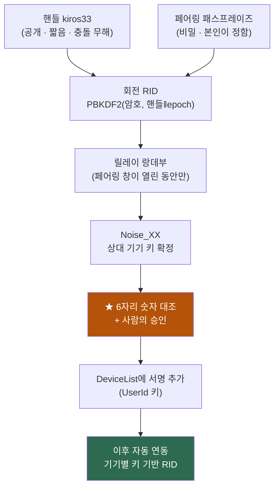

# 09 · 신원과 페어링 — UserId를 어떻게 정하고, 기기를 어떻게 붙이나

> **사용자 제안(2026-08-25)**: *"UserId는 직접 등록하도록 느슨하게 관리하고, 동일 UserId 중에서 연결 가능한 PeerId를 기준으로 사용자가 직접 등록하게 함으로써 신뢰성을 올리는 방안이 적당해 보이는데, 더 좋은 방법이 있으면 알려줘."*
> **제약(같은 날)**: *"UserId를 너무 길게 입력하게 하거나 외울 수 없는 값이거나, 혹은 기존 PC에서 직접 보고(혹은 다운로드 받아서) 연결해야 하는 경우는 즉시 사용이 어려울 수 있다."*
>
> **결론**: ★ **제안의 뼈대는 옳다** — *"이름은 사람이 정하고, 신뢰는 사람이 승인한다"* 는 이 문제의 정답 형태다([§1](#1-제안-평가--뼈대는-옳다)).
> 다만 **구멍이 하나 있고**([§4](#4-️-제안의-구멍--userid를-랑데부에-그대로-쓰면-열거된다)), 제약 셋을 **동시에** 만족하는 변형이 있다 —
> ★ **UserId(공개·짧음) + 페어링 패스프레이즈(비밀·짧음)** 로 랑데부를 파생하는 안([§6](#6--권장안--userid--패스프레이즈-파생-랑데부)).
>
> 작성 2026-08-25 · 선행 = [07 랑데부](07-device-rendezvous.md) · [05 다중 기기](05-multi-device-sharing.md) · `nexa-beep` ADR-0007.

---

## 1. 제안 평가 — 뼈대는 옳다

제안의 핵심은 **신뢰의 출처를 "이름"이 아니라 "사람의 승인"에 두는 것**이다. 이건 우연히 맞은 게 아니라 **이 문제의 정답 형태**다.

| 제안 요소 | 평가 |
|---|---|
| UserId를 **사용자가 직접 등록**(중앙 관리 없음) | ★ **옳다** — 서버가 계정을 관리하는 순간 릴레이가 관리 서버로 미끄러진다([07 §1](07-device-rendezvous.md#1-먼저-못-박을-것--서버가-같은-사람을-알면-안-된다)) |
| UserId를 **느슨하게** 관리(전역 유일성 강제 안 함) | ★ **옳다** — 유일성을 강제하려면 **선점 등록소**가 필요하고, 그건 곧 서버가 신원을 아는 구조다 |
| **PeerId를 사용자가 직접 승인**해 신뢰를 올린다 | ★★ **정확하다** — 이름은 누구나 주장할 수 있으므로, **신뢰는 키에만 붙어야 한다**(beep TOFU 원리와 동일) |

### 1-1. 왜 "느슨한 이름"이 안전한가

> ★ **이름이 신뢰를 지지 않기 때문이다.**

두 사람이 똑같이 `kiros33`을 등록해도 사고가 안 난다. 이름이 같아도 **키가 다르고, 승인하지 않은 키는 붙지 못한다.** beep의 *"같은 이름, 다른 지문 = 다른 사람"* 규칙이 그대로 적용된다.

---

## 2. 핵심 원리 — **이름과 키를 분리한다**

제안의 `UserId`에는 성격이 다른 둘이 섞여 있다. 나눠 두어야 설계가 흐려지지 않는다.

| | **핸들**(사람이 정함) | **UserId 키**(자동 생성) |
|---|---|---|
| 예 | `kiros33` | X25519/Ed25519 키쌍 |
| 사람이 보는가 | ✅ 화면·입력에 나온다 | ✕ 보이지 않는다 |
| 하는 일 | **랑데부 힌트 · 라벨** | ★ **`DeviceList` 서명** — "이 기기는 내 것" |
| 비밀인가 | ✕ 공개 | ✅ 개인키는 로컬에만 |
| 충돌하면 | 상관없다([§1-1](#1-1-왜-느슨한-이름이-안전한가)) | 충돌 불가(키) |

> ★ **한 줄** — **이름은 사람이 정하고, 신뢰는 키가 진다. 그 키를 인정하는 행위가 "승인"이다.**

---

## 3. UserId 키가 실제로 사주는 것 — **페어링 횟수**

*"그럼 키는 왜 필요한가? 기기마다 서로 승인하면 되지 않나?"* — 이 질문의 답이 UserId 키의 존재 이유다.

| 방식 | 기기 3대 | 기기 5대 | 새 기기 추가 시 |
|---|:--:|:--:|---|
| **쌍별 승인**(키 없음) | 3회 | **10회** | ★ **기존 기기 전부와** 각각 페어링 |
| ★ **UserId 키 서명** | 2회 | 4회 | ★ **아무 기존 기기 하나와만** 페어링 → 나머지는 자동 수용 |

> ★ **"느슨하게 관리하고 싶다"는 요구에 정확히 답하는 것이 이 구조다.**
> 한 번 승인하면 **그 기기가 `DeviceList`에 서명되어 들어가고, 나머지 기기가 자동으로 받아들인다.**
> 사용자는 **승인 한 번**만 하고, 이후 관리는 하지 않는다.

---

## 4. ⚠️ 제안의 구멍 — UserId를 랑데부에 그대로 쓰면 **열거된다**

제안을 그대로 구현하면, 새 기기가 기존 기기를 찾기 위해 **핸들 문자열에서 랑데부 ID를 파생**하게 된다.

```
RID = H("kiros33" ‖ epoch)      ← 누구나 계산할 수 있다
```

**여기서 beep 회전 RID가 지키던 성질이 무너진다.**

| # | 구멍 | 결과 |
|:--:|---|---|
| **R-a** | ★ **열거(enumeration)** | 공격자가 흔한 아이디 사전으로 RID를 대량 계산해 **"누가 지금 온라인인지" 스캔**할 수 있다. 릴레이는 전 세계 접속을 한 점에 모으므로 피해가 크다 |
| **R-b** | **연결 시도 폭주** | 아무나 내 랑데부 지점에 `Open`을 던진다. 승인은 막아도 **팝업 폭탄**은 남는다 |
| **R-c** | **핸들 충돌** | 같은 핸들을 쓰는 남과 랑데부에서 계속 마주친다(보안 사고는 아니지만 잡음) |
| **R-d** | ★ **승인 피로** | 승인 창이 자주 뜨면 사용자가 **습관적으로 승인**한다 → 승인 절차가 무의미해진다. **R-b가 R-d를 만든다** |

> ★ **R-d가 진짜 위험이다.** 보안은 뚫리는 게 아니라 **닳아서** 무너진다. 승인 팝업을 희소하게 유지하는 것이 암호보다 중요할 수 있다.

---

## 5. ★ 삼각 트레이드오프 — 셋 중 둘

사용자 제약을 그대로 축으로 놓으면 이렇게 된다.

| 방식 | 열거 저항 | 기존 PC 안 봐도 됨 | 즉시성(짧고 외울 수 있음) |
|---|:--:|:--:|:--:|
| **핸들만** (제안 그대로) | ✕ | ✅ | ✅ |
| **페어링 코드**(기존 PC가 발급) | ✅ | ✕ | ✅ |
| **긴 공개키 hex 교환**(beep 현행) | ✅ | ✕ | ✕ |
| ★ **핸들 + 패스프레이즈** | ✅ | ✅ | ✅ |

> 👉 **마지막 줄이 삼각형을 깬다.** 비밀을 *기존 기기에서 가져오는 대신* **사용자 머릿속에서 가져오기** 때문이다.

---

## 6. ★ 권장안 — 핸들 + 패스프레이즈 파생 랑데부

### 6-1. 사용자가 하는 일

새 기기에서 **두 줄**을 입력한다. 둘 다 본인이 정한 값이라 외울 수 있고, **어디서 보고 옮겨 적을 필요가 없다.**

```
 내 아이디   [ kiros33            ]     ← 공개. 짧다
 페어링 암호 [ ••••••••           ]     ← 비밀. 본인이 정한 것
```

### 6-2. 랑데부 파생

```
RID_epoch = PBKDF2-HMAC-SHA256( 패스프레이즈,
                                salt = "nclip-rid-v1" ‖ 핸들 ‖ epoch_day,
                                iters = 높게 )[..16]
```

| 성질 | 효과 |
|---|---|
| **패스프레이즈를 모르면 계산 불가** | ★ **R-a(열거) 소멸** — 사전 스캔이 성립하지 않는다 |
| **KDF 신장(stretching)** | 추측 1회마다 비용이 든다. 약한 암호도 대량 시도를 비싸게 만든다 |
| **에폭마다 회전** | 공격자는 **하루치 작업을 매일 다시** 해야 한다 |
| **핸들이 salt에 들어간다** | ★ **R-c(충돌) 소멸** — 같은 핸들이라도 암호가 다르면 서로 안 만난다 |
| **`sha2`만 쓴다** | PBKDF2-HMAC-SHA256은 이미 있는 의존으로 구현된다(DR-8 외부 crate 0 지향 유지) |

> ⚠️ **패스프레이즈는 "계정 비밀번호"가 아니다.** 서버로 가지 않고, 인증에 쓰이지 않는다.
> **오직 만남 지점을 남이 계산하지 못하게 하는 재료**다. 유출돼도 **승인 없이는 아무것도 못 한다** — 방어선이 하나 더 있다.

### 6-3. 그래도 승인은 남는다 — **여기는 타협하지 않는다**

랑데부가 성립해도 **자동으로 붙지 않는다.** 기존 기기에서 사람이 승인해야 `DeviceList`에 들어간다.

> 🔴 **왜 이 한 단계는 없앨 수 없나** — 없애면 **패스프레이즈를 아는 것만으로 내 클립보드 전체에 접근**하게 된다.
> 클립보드는 **비밀번호·API 토큰이 매일 지나가는 통로**다([05 §2](05-multi-device-sharing.md#2--경고--릴레이는-닿는가를-풀지-같은-사람인가를-풀지-않는다)).
> 여기서 마찰을 없애는 것은 편의가 아니라 **자격 증명 유출 파이프를 만드는 일**이다.

**대신 승인을 가볍게 만든다.**

| 완화 | 내용 |
|---|---|
| **승인은 "입력"이 아니라 "보기"** | 양쪽 화면에 **6자리 숫자**가 뜬다. 옮겨 적지 않고 **같은지 눈으로 확인**만 한다(3초) |
| **1회뿐** | 기기당 최초 1회. 이후 자동([§3](#3-userid-키가-실제로-사주는-것--페어링-횟수)) |
| ★ **페어링 창** | 평소에는 랑데부가 **닫혀 있다.** *"새 기기 추가"* 를 누른 동안(예: 3분)만 열린다 → **R-b·R-d 소멸**(모르는 요청이 애초에 도달하지 않는다) |
| 승인 화면 정보 | 기기 이름·OS·요청 시각·접속 대역을 함께 보여준다 |

---

## 7. 페어링 UX — 세 경로

| 경로 | 사용자 동작 | 입력할 것 | 소요 |
|---|---|---|---|
| ★ **A. 같은 LAN** | 새 기기 실행 → *"내 기기 찾기"* → 목록에 기존 PC가 뜬다 → 숫자 6자리 대조 → 기존 PC에서 승인 | ★ **없음**(핸들조차 불필요) | ~10초 |
| **B. 원격** | 기존 PC에서 *"새 기기 추가"*(페어링 창 열기) → 새 기기에 **핸들 + 패스프레이즈** 입력 → 숫자 대조 → 승인 | 짧은 두 줄 | ~30초 |
| **C. 기존 기기가 없다**(분실·초기화) | **복구 시드**로 UserId 키를 재구성 | 미리 보관한 시드 | — |

> ★ **A가 기본 경로다.** *"기존 PC에서 보고 옮겨 적어야 한다"* 는 걱정이 **A에서는 아예 발생하지 않는다** — 발견이 자동이라 입력할 값이 없고, 확인은 숫자 대조 3초다.
> **B에서도 옮겨 적는 값은 없다** — 두 줄 다 사용자가 원래 아는 값이다.

### 7-1. C(복구 시드)에 대한 정직한 설명

**기존 기기가 하나도 없으면 승인해 줄 주체가 없다.** 이때만 시드가 필요하다.

| | 내용 |
|---|---|
| 언제 쓰나 | ★ **평상시엔 절대 안 쓴다.** 유일한 기기를 잃었을 때만 |
| 외워야 하나 | ✕ — 발급 시 **인쇄·안전한 곳 보관**을 안내한다 |
| 없으면 | 새 신원으로 시작(기존 기기 목록·기록과 단절) — **정직하게 고지** |

> 이건 beep ADR-0007 §9의 *"주 기기 전용 + 오프라인 복구 시드"* 와 같은 결론이다.

---

## 8. 누가 승인할 수 있나 — 엄격 vs 느슨

`DeviceList`에 서명하려면 UserId 개인키가 필요하다. **그 키를 어느 기기가 갖는가**가 갈림길이다.

| | **엄격 — 주 기기만** | ★ **느슨 — 신뢰된 아무 기기나** |
|---|---|---|
| 새 기기 추가 | 주 기기가 켜져 있어야 한다 | **아무 기기에서나** 승인 가능 |
| 사용자 경험 | 주 기기를 못 켜면 막힌다 | ★ 사용자 표현 *"느슨하게 관리"* 에 부합 |
| 위험 | 낮다 | ⚠️ **기기 하나가 탈취되면 공격자가 자기 기기를 추가**할 수 있다 |

### 권장 — **느슨 + 알림 + 거부권**

| 규칙 | 내용 |
|---|---|
| **G-1** | 신뢰된 어느 기기에서든 승인할 수 있다(느슨) |
| **G-2** | ★ **기기가 추가되면 전 기기에 알린다** — *"노트북에서 '아이패드'를 추가했습니다"* |
| **G-3** | 주 기기는 **되돌릴 수 있다**(즉시 폐기 + version 증가) |
| **G-4** | 기기 관리 화면에 **추가 이력**(언제·어느 기기가 승인)을 남긴다 |

> ★ **G-2가 핵심이다.** 승인 권한을 넓히는 대신 **모르게 일어나지 않도록** 만든다.
> beep DR-28 *"신원이 바뀌면 시끄럽게"* 의 적용이다.

---

## 9. 최종 형태 (요약)



| 단계 | 무엇이 신뢰를 만드는가 |
|---|---|
| 핸들 | ✕ 아무것도 — **라벨일 뿐** |
| 패스프레이즈 | △ **만남을 가리는 것**뿐(열거 방어) |
| Noise | △ 상대가 **그 키의 주인**임 |
| ★ **사람의 승인** | ✅ **여기서만 신뢰가 생긴다** |
| DeviceList 서명 | ✅ 그 승인을 **나머지 기기에 전파** |

> ★ **사용자 제안의 핵심("사용자가 직접 PeerId를 등록해 신뢰성을 올린다")이 이 표의 굵은 줄 그대로다.**
> 우리가 더한 것은 **그 승인이 희소하고 의미 있게 유지되도록** 앞단을 가린 것뿐이다.

---

## 10. 열린 결정 — ✅ 전부 닫힘(08-31 사용자 확정 · 권장안 일괄 → [DR-39](10-decision-record.md))

| # | 결정할 것 | 선택지 | 권장 |
|---|---|---|---|
| **D-24** | 랑데부 파생 재료 | 핸들만 · ★ **핸들 + 패스프레이즈** · 페어링 코드 | ★ 핸들 + 패스프레이즈([§6](#6--권장안--핸들--패스프레이즈-파생-랑데부)) — 제약 셋을 다 만족 |
| **D-25** | 페어링 창 | 상시 열림 vs ★ **명시적으로 연 동안만**(3분) | ★ 창 방식 — R-b·R-d를 원천 차단 |
| **D-26** | 승인 권한 | 주 기기 전용 vs ★ **느슨 + 알림 + 거부권** | ★ 느슨([§8](#8-누가-승인할-수-있나--엄격-vs-느슨)) |
| **D-27** | 대조 방식 | 6자리 숫자 · QR · 양쪽 표시 vs 한쪽만 | 숫자 기본 + **모바일은 QR**([08 §9](08-clipboard-propagation.md#9-모바일-수신-android--ios--최하순위-목표-사용자-확정-2026-08-25)) |
| **D-28** | KDF | PBKDF2-HMAC-SHA256(`sha2`로 자체 구현) vs Argon2(외부 crate) | ★ PBKDF2 — DR-8 유지 |
| **D-29** | 패스프레이즈 최소 강도 | 강제 없음 vs 최소 길이 vs 강도 표시만 | 강도 표시 + 약하면 경고(강제는 이탈을 부른다) |
