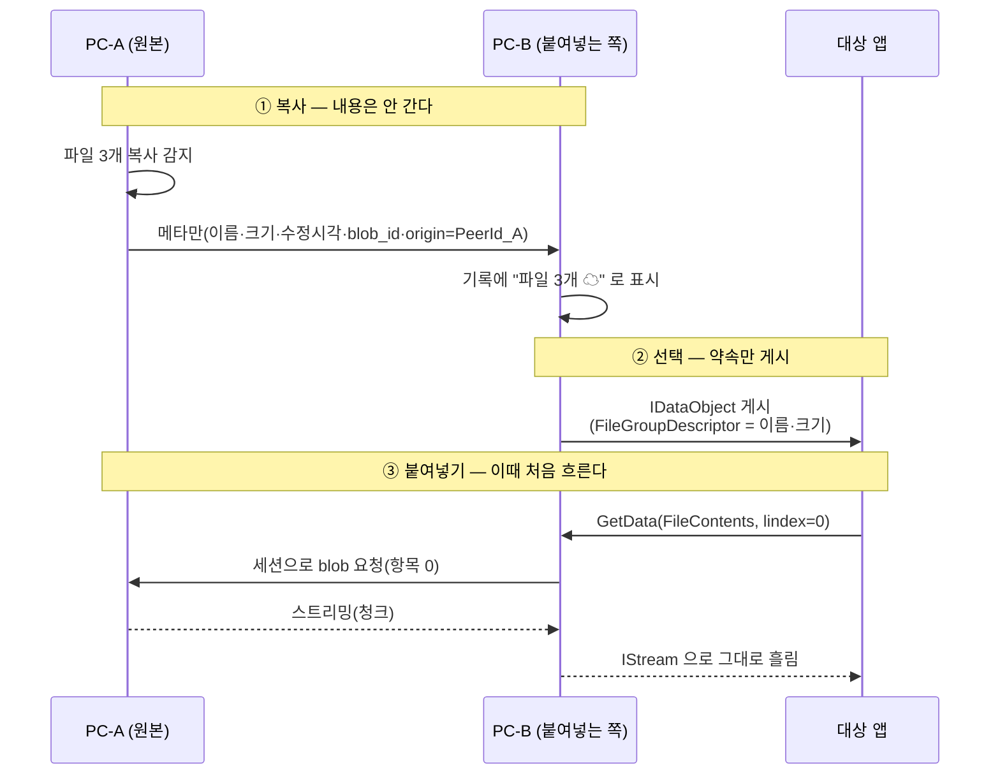

# 26 · 파일 내용 공유 — 붙여넣는 순간 원본 PeerId에서 받아온다 (확장 설계)

> **사용자 요구(2026-08-26)**: *"차후 **파일을 복사 대상으로 전달**하고 **붙여넣기 시에 원 PeerId에서 수신을 받는** 방식으로 파일도 공유되도록 기능 확장하고 싶다. 설계에 반영해줘."*
> *"현재 기준에서는 **동일 `UserId`에서만** 동작하도록 제약할 것."*
>
> **상태**: 📐 **설계만 — 지금 구현하지 않는다**([DR-26](10-decision-record.md) 점증 개발).
> 지금은 [DR-6](10-decision-record.md)대로 **경로 목록만** 전파한다([08 §3](08-clipboard-propagation.md)).
>
> ★ **이건 발명이 아니라 OS가 이미 가진 메커니즘**이다 — Windows **지연 렌더링(가상 파일)** · macOS **파일 약속**.
> RDP·Outlook 첨부·탐색기 zip 내부가 전부 이 규약으로 돈다.

---

## 1. 무엇이 달라지나

| | **지금**([DR-6](10-decision-record.md)) | **확장 후** |
|---|---|---|
| 전파하는 것 | **경로 문자열**(`D:\작업\보고서.xlsx`) | **경로 + 내용 약속**(promise) |
| 상대 PC에서 | ⚠️ 경로가 없으면 **텍스트로 강등**([08 §3-2](08-clipboard-propagation.md#3-2-권장--다적응형--목록-ui에-상태-표시)) | ★ **진짜 파일로 붙여넣어진다** |
| 언제 전송되나 | — | ★ **붙여넣는 순간**(그 전에는 메타만) |
| 대상 | 내 기기 + 남 | ★ **같은 `UserId`(내 기기)만** — [§5](#5-왜-지금은-같은-userid-만인가) |

> ★ **핵심은 "미리 보내지 않는다"** — 붙여넣지 않을 파일을 전송하는 것은 낭비고,
> 클립보드는 **복사한 것의 대부분을 붙여넣지 않는다.**

---

## 2. OS 메커니즘 — 우리는 **제공하는 쪽**이 된다

`nexa-dir2`가 **X-42에서 받는 쪽**을 이미 구현했다(RDP·Outlook·zip에서 오는 가상 파일을 붙여넣기).
우리는 그 **반대편**을 만든다.

| OS | 규약 | 우리가 하는 일 |
|---|---|---|
| **Windows** | `CFSTR_FILEDESCRIPTOR`(`FileGroupDescriptorW` — 항목 목록) + `CFSTR_FILECONTENTS`(`FileContents` — 항목별 `IStream` **지연 스트리밍**) | `IDataObject`를 우리가 게시하고, 붙여넣는 앱이 `GetData(FileContents, lindex)` 를 부르면 **그때 원본 피어에서 스트리밍** |
| **macOS** | `NSFilePromiseProvider` + delegate | 약속만 올리고, 요청이 오면 **임시 위치에 쓰면서** 스트리밍 |
| **Linux/X11** | ✕ **표준 지연 전송이 없다**(`text/uri-list`만) | **임시 파일로 먼저 받아** 경로를 제공(사실상 사전 다운로드) |
| **Linux/Wayland** | 동일 제약 | 동일 |

### 2-1. ★ `nexa-dir2` X-42에서 그대로 가져올 교훈

**같은 규약의 반대편이라 함정도 같다.** dir2가 실기에서 잡은 것들:

| # | 교훈 | 우리에게 |
|:--:|---|---|
| **X-1** | ★ `FileContents`는 **`lindex` 지정**을 요구해 **원시 `GetClipboardData`로는 불가** — `OleGetClipboard` → `IDataObject` 경로여야 한다 | 제공 측도 **`IDataObject` 구현**이 필수(단순 `SetClipboardData`로 안 된다) |
| **X-2** | ★ `FILEDESCRIPTORW`가 **packed 구조체**라 배열 필드 참조가 `E0793` | **값 복사로 우회**(dir2와 같은 처방) |
| **X-3** | ★ **워커화 필수** — dir2는 `CoMarshalInterThreadInterfaceInStream`으로 `IStream`을 워커(MTA)에 넘겨 **UI 펌프 비의존**으로 만들었다 | 우리는 **네트워크에서 읽는다** — UI 스레드에서 하면 **대용량에서 창이 굳는다**. 같은 처방 |
| **X-4** | 항목별 **실패 격리** · 이름 충돌 `" (2)"` · 경로 탈출 기각(`..`·절대·드라이브) | 그대로 필요 — ★ **우리는 이름이 네트워크에서 온다**(더 위험) |

> 👉 **dir2의 X-42 코드가 읽는 쪽 참조 구현으로 그대로 쓸 수 있다** — 포맷 파싱·구조체 정의·워커 패턴이 같다.

---

## 3. 흐름



| 규칙 | 내용 |
|---|---|
| **P-1** | ★ **메타는 즉시, 내용은 붙여넣을 때** — 복사 시점에 전송하지 않는다 |
| **P-2** | ★ **스트리밍한다** — 전체를 메모리에 올리지 않는다(대용량이 예사다) |
| **P-3** | 원본이 이미 로컬에 있으면(같은 PC) **네트워크를 타지 않는다** |
| **P-4** | `blob_id = H(암호문)` 이므로 **이미 받은 적 있으면 재전송이 생략**된다([06 §2-3](06-storage-design.md#2-3-내용-주소-blob--중복-제거가-공짜로-온다)) |
| **P-5** | 진행률·취소를 **붙여넣는 앱이 아니라 우리 UI**가 보여준다(앱은 `IStream`만 안다) |

---

## 4. ⚠️ 이 설계의 급소 — 원본이 꺼져 있으면?

★ **릴레이가 "파이프"인 것과 같은 제약**이다([07 §4-1](07-device-rendezvous.md#4-1-️-릴레이는-버퍼가-아니라-파이프다)) —
**붙여넣는 순간 원본 기기가 켜져 있어야 한다.**

| 상황 | 동작 |
|---|---|
| 원본 온라인 | ✅ 정상 스트리밍 |
| 원본 오프라인 | ⚠️ ★ **붙여넣기 실패** — `IStream`이 에러를 돌려주면 **대상 앱이 조용히 아무것도 안 붙인다** |
| 전송 중 끊김 | 부분 파일이 남는다 → **파편 소거**(dir2 X-42 선례) |

### 4-1. 처방 — ★ **상태 전이 + 로그**(모달 없음 · 사용자 확정 2026-08-26)

> **사용자 확정**: *"붙여넣는 순간 복사 원본 기기가 꺼져 있다면 **상태를 업데이트**하고 **붙여넣을 수 없는 대상으로 설정**. 기본은 **내부 로그 창에 원인과 조치**를 남기고, **모달 창 안내는 지금은 제외**."*

#### 항목 상태 기계

```text
Ready ──원본 오프라인 감지──▶ OriginOffline   ← ★ "붙여넣을 수 없는 대상"
  ▲                              │
  └──── 원본 재접속 ─────────────┘

Ready ──붙여넣기──▶ Fetching ──실패──▶ Failed ──재시도──▶ Fetching
```

| 상태 | 목록 표시 | 붙여넣기 |
|---|---|---|
| `Ready` | 평소 | ✅ 파일로 |
| ★ `OriginOffline` | **흐리게 + `☁ 원본 오프라인` 배지** | ⛔ **파일로는 불가** — [§4-2](#4-2-불가할-때-무엇을-주나) |
| `Fetching` | 진행률 | (진행 중) |
| `Failed` | `⚠ 받기 실패` 배지 | ⛔ · 재시도 가능 |

| 규칙 | 내용 |
|---|---|
| **R-1** | ★ **상태를 미리 갱신한다** — 원본 연결이 끊기면 **붙여넣기를 시도하기 전에** 목록이 먼저 바뀐다 |
| **R-2** | **작은 파일 사전 캐시**(설정 · 기본 1MB) → 캐시된 항목은 원본이 꺼져도 `Ready`를 유지한다 |
| **R-3** | ★ **모달을 띄우지 않는다**(사용자 확정) — 흐름을 끊지 않는다 |
| **R-4** | ★ **로그 창에 원인 + 조치를 남긴다** — [§4-3](#4-3--로그-창이-기본-통보-채널이다) |
| **R-5** | 고정(핀)한 파일 항목은 **자동 사전 캐시** 후보 |
| **R-6**(2차) | 오프라인 큐(컨텐츠 서버 · [22 I-3](22-upstream-beep-liaison.md))가 생기면 이 제약이 완화된다 |

#### 4-2. 불가할 때 무엇을 주나

★ **아무것도 안 주지 않는다.** 파일로는 못 줘도 **경로 텍스트는 줄 수 있다** —
이미 있는 적응형 폴백([08 §3-2](08-clipboard-propagation.md#3-2-권장--다적응형--목록-ui에-상태-표시))이 그대로 받는다.

| 상황 | 클립보드에 올리는 것 |
|---|---|
| `Ready` | **파일 객체**(지연 렌더링 약속) |
| ★ `OriginOffline` / `Failed` | **경로 텍스트**(+ 목록에 사유 배지) |

> 이 폴백 덕에 **"붙여넣었는데 아무 일도 안 일어난다"** 가 생기지 않는다 —
> 대상 앱이 침묵하는 최악의 경우를 구조적으로 피한다.

#### 4-3. ★ 로그 창이 기본 통보 채널이다

| 규칙 | 내용 |
|---|---|
| **L-1** | ★ **원인과 조치를 함께** 남긴다 — *"무엇이 잘못됐나"* 만으로는 사용자가 할 일을 모른다 |
| **L-2** | 로컬 전용 · 외부 전송 0([DR-20](10-decision-record.md)) |
| **L-3** | 상한 있는 링 버퍼(메모리) — 상주 앱이므로 무한 증가 금지 |
| **L-4** | 민감 정보는 **남기지 않는다** — 항목 내용이 아니라 **id·타입·크기·사유**만 |

**남기는 형태**

```text
14:32:07  경고  파일 받기 불가 — 원본 기기 오프라인
          항목: 3개 파일(보고서.xlsx 외 2) · 출처: A-데스크톱
          원인: 원본 기기와 세션이 없습니다(마지막 접속 14:05)
          조치: A-데스크톱을 켜거나, 설정 → 동기화에서 사전 캐시 크기를 늘리세요
```

---

#### 4-4. ★ 최대 크기 — 전송 **중**이 아니라 **제안할 때** 자른다

> **사용자 확정(08-26)**: *"최대 파일 크기를 설정해서 붙여넣기 시에 확인을 통해 최대 용량 초과 등의 기록이 로그에 남고, 제안해 준 대로 파일의 경로 등만 붙여넣기 되도록."*

**설정**: `sync.file_max_mb` — 원격에서 **받아올** 파일 하나의 상한(기본값은 [D-67](#7-열린-결정)).

★ **가장 중요한 것은 "언제 판단하느냐"** 다.

| 언제 검사하나 | 결과 |
|---|---|
| ❌ 전송 중에 상한을 넘으면 끊는다 | **대상 앱이 이미 붙여넣기를 시작한 뒤**다. 반쯤 받은 파일이 남고, 앱은 실패를 조용히 삼킨다 |
| ✅ ★ **클립보드에 올릴 때 검사한다** | 상한을 넘으면 **파일 표현을 아예 제안하지 않는다**. 대상 앱은 처음부터 경로 텍스트만 본다 |

우리는 복사 시점에 **파일 크기 메타데이터**를 함께 받아 두므로([§3](#3-흐름)), 내용을 한 바이트도
받기 전에 판단할 수 있다. ★ **실패할 약속을 하지 않는 것**이 이 설계의 핵심이다 —
지연 렌더링에서 *"주겠다고 해 놓고 못 준다"* 는 대상 앱을 침묵시킨다.

**동작**

```text
붙여넣기 요청
   │
   ├─ 크기 ≤ 상한  → 파일 객체 + 경로 텍스트를 함께 올린다
   │
   └─ 크기 > 상한  → ★ 경로 텍스트만 올린다
                     + 목록 항목에 `경로만(용량)` 배지
                     + 로그에 원인·조치
```

```text
15:07:41  경고  파일 내용 대신 경로만 제공 — 용량 상한 초과
          항목: 1개 파일 · 3.2 GB · 출처: A-데스크톱
          원인: 원격 파일 크기가 상한(100 MB)을 넘습니다
          조치: 설정 → 동기화 → "원격 파일 최대 크기"를 올리거나,
                원본 기기에서 직접 복사하세요
```

⚠️ **여러 파일을 한 번에 복사한 경우**는 **개별이 아니라 합계**로 본다 —
100MB 파일 50개는 개별로는 통과하지만 붙여넣기 한 번에 5GB가 흐른다. → **D-68**

---

#### 4-5. ★ 붙여넣는 앱에 따라 달라야 한다 — **그런데 옵션이 아니다**

> **사용자 질문(08-26)**: *"파일 탐색기는 파일을 받으면 되지만, 텍스트·문서 편집기는 경로만 붙어야 하고, PPT는 파일 객체로 붙일지 판단이 필요할 것 같다. 이런 부분은 옵션 처리로 해야 할까?"*

**대부분은 옵션이 필요 없다.** 클립보드가 이미 이 문제를 푸는 구조이기 때문이다 —
★ **여러 표현을 동시에 올려 두고, 어느 것을 쓸지는 받는 앱이 고른다**
([27 P-2](27-capture-cases.md)).

**우리가 한 번에 올리는 것**

| 표현 | 이걸 집는 앱 | 결과 |
|---|---|---|
| 파일 객체(지연 렌더링) | **파일 탐색기** · 메일 첨부 · 업로드 대화상자 | 파일이 실제로 복사된다 |
| `CF_UNICODETEXT` (경로) | **메모장 · 코드 편집기 · 채팅 입력창 · 주소창** | `D:\문서\보고서.xlsx` |
| `CF_HTML` (경로 링크) | 메일 본문 · 위키 | 링크가 걸린 경로 |

- **파일 탐색기**는 파일 표현이 있으면 그것만 본다 → 자동으로 맞다.
- **텍스트 편집기**는 파일 표현을 이해하지 못한다 → 남은 것 중 최선인 평문을 집는다 → 자동으로 맞다.
- ★ **PowerPoint·Word처럼 둘 다 할 수 있는 앱**만 애매하다.

**★ PPT처럼 애매한 앱은 — 설정이 아니라 `단축키`로 그 자리에서 고른다**

> **사용자 확정(08-26)**: *"옵션이 아니면 단축키를 추가해서 선택할 수 있도록 하는 방법도 괜찮은 것 같아."*

**설정이 아니라 단축키인 이유**

| 설정이면 | 단축키면 |
|---|---|
| ⚠️ 붙여넣기 **전에** 대상 앱을 예상해 미리 바꿔 둬야 한다 — **순서가 거꾸로다** | ✅ **붙여넣는 그 순간** 정한다 — 사용자는 지금 어디에 붙이는지 안다 |
| ⚠️ 한 번 바꾸면 **다음번에도** 그대로다(잊어버린 설정이 사고를 만든다) | ✅ **그 한 번에만** 적용된다 |
| ⚠️ 앱 목록·규칙을 유지해야 한다(영원히 늙는다) | ✅ 앱을 **알 필요가 없다** |

### 붙여넣기 **모드** — `평문 붙여넣기`와 **같은 자리**에 하나 더

> **사용자 확정(08-26)**: *"Plain text로 붙여넣기랑 비슷하게 **객체로 붙여넣기** 단축키를 지정하게 하는 방법이지."*

★ 새 개념이 아니다. 이미 있는 [`PasteAs`](../crates/nclip-core/src/paste.rs) **사다리에 칸을 더하는 것**이다.

| 모드 | 키 | 올리는 것 | 결과 |
|---|---|---|---|
| **원본** (기본) | `Enter` | ★ 가진 표현 **전부** | 탐색기 → 파일 · 메모장 → 경로 · PPT → 개체 |
| **평문** | `⇧Enter` | 평문 하나만 | 어디에 붙여도 **글자**([12 §5](12-clipboard-formats.md) · 기존 기능) |
| ★ **객체로** | `⌘Enter` (Win `Ctrl+Enter`) | **파일/개체 표현만** — 텍스트를 뺀다 | PPT·Word가 **파일 개체**로 받을 수밖에 없다 |
| ★ **경로만** | `⌥Enter` (Win `Alt+Enter`) | **경로 텍스트만** — 파일 표현을 뺀다 | 경로 **글자**로 붙는다. ★ 원격 내용을 **끌어오지 않는다**(회선 절약) |

★ **네 모드가 전부 같은 방식으로 동작한다 — "고르는" 게 아니라 "빼는" 것이다.**
우리는 대상 앱을 탐지하지 않고, **올리는 표현을 좁혀서** 앱이 고를 수밖에 없게 만든다.
`평문`이 텍스트만 남기는 것과 `객체로`가 파일만 남기는 것은 **완전히 같은 기계**다.

★ **이게 P-2와 모순되지 않는 이유**: 우리는 여전히 *"어느 표현이 맞는지"* 를 판단하지 않는다.
**메뉴를 좁힐 뿐이고**, 좁힌 메뉴 안에서 고르는 건 여전히 받는 앱이다.

### ⚠️ 발견 가능성 — 단축키는 **보이지 않으면 없는 것**이다

설정은 뒤져서 찾기라도 하지만 단축키는 모르면 영원히 안 쓴다. 그래서:

- ★ **팝업 아래 힌트 줄이 선택 항목에 따라 바뀐다.**
  파일 항목을 고르면 `Enter 붙여넣기 · ⌘Enter 객체로 · ⌥Enter 경로만` 이 뜨고,
  서식 텍스트 항목에서는 `Enter 붙여넣기 · ⇧Enter 평문` 만 뜬다.
- **해당 없는 모드는 아예 안 보인다** — 이미지 항목에 *"경로만"* 을 띄우면 거짓말이다.
  ★ `PasteAs::applicable(kind)`가 **한 곳에서** 판정하고, 힌트 줄·우클릭 메뉴·키 처리가 **같은 답**을 쓴다.
- 우클릭 메뉴에도 같은 항목을 **같은 이름**으로 둔다(키를 못 외운 사람의 길).

> 상한 초과([§4-4](#4-4--최대-크기--전송-중이-아니라-제안할-때-자른다))는 이 사다리와 **무관하게** 동작한다 —
> `⌘Enter`(객체로)를 눌러도 상한을 넘으면 **경로만** 나가고 로그에 이유가 남는다.
> ★ 사용자의 의사보다 **"실패할 약속을 하지 않는다"** 가 먼저다.

---

## 5. 왜 지금은 같은 `UserId`만인가

사용자 확정이자 **설계상 타당한 제약**이다.

| # | 이유 |
|:--:|---|
| **①** | ★ **파일은 클립보드 항목보다 위험이 다르다** — 실행 파일·대용량·경로 탈출·이름 위장(RLO). 남에게서 오는 파일은 **무해화 게이트**가 필요하다(`nexa-beep` `nbeep-safe`의 `.beepq` 격리 규약 · [05](05-multi-device-sharing.md) 참조) |
| **②** | **내 기기끼리는 이미 승인이 끝나 있다**([DR-28](10-decision-record.md)) — 항목마다 묻지 않는 전제가 성립한다. 남과는 [DR-22](10-decision-record.md)·[DR-29](10-decision-record.md)의 승인이 붙어야 하고, **파일에는 그것만으로 부족**하다 |
| **③** | ★ **원본 상시 연결 전제**가 내 기기에서는 자연스럽고 남과는 아니다 — 남의 PC가 켜져 있기를 기대하는 UX는 성립하기 어렵다 |
| **④** | [DR-26](10-decision-record.md) 점증 개발 — **되는 범위부터** 낸다 |

> 🔴 **나중에 남에게도 열려면** 무해화 게이트(격리 → 검사 → 승인 → 실체화)가 **선행 조건**이다.
> 그건 파일 공유 기능이 아니라 **보안 기능**이고, 별도 설계가 필요하다 → [D-63](#7-열린-결정).

---

## 6. 요구 등재

| ID | 기능 | 우선 | 비고 |
|---|---|:--:|---|
| **FR-Y-18** | ★ **파일 내용 공유 — 붙여넣는 순간 원본 `PeerId`에서 지연 수신** | **P2**(M3) | 📐 설계만 |
| **FR-Y-19** | ★ **같은 `UserId` 기기 간에만** 동작 | **P2** | 사용자 확정 제약 |
| **FR-Y-20** | 원본 오프라인 시 ★ **상태 전이 + 목록 배지 + 로그 창 기록**(모달 없음) | **P2** | [DR-31](10-decision-record.md) · R-1·R-3·R-4 |
| **FR-Y-21** | **작은 파일 사전 캐시**(크기 상한 설정) | **P2** | R-2 — 실패의 대부분을 없앤다 |
| **FR-Y-22** | ★ **원격 파일 최대 크기** — 넘으면 **경로만** 제공 + 로그 | **P2** | [§4-4](#4-4--최대-크기--전송-중이-아니라-제안할-때-자른다) · 사용자 확정 |
| **FR-Y-23** | ★ **파일 + 경로를 함께 제안** — 어느 것을 쓸지는 받는 앱이 고른다 | **P2** | [§4-5](#4-5--붙여넣는-앱에-따라-달라야-한다--그런데-옵션이-아니다) |
| **FR-Y-24** | ★ **붙여넣기 모드 확장** — `PasteAs`에 **객체로**(`⌘Enter`) · **경로만**(`⌥Enter`) 추가 | **P2** | 평문 붙여넣기와 **같은 기계** · 사용자 확정 |
| **FR-Y-25** | ★ **팝업 힌트 줄이 항목 종류에 따라 바뀐다** | **P1** | 단축키는 보이지 않으면 없는 것이다 |
| **✂** | **대상 앱 탐지 후 표현 선택** | **✂ 범위 밖** | 앱 목록은 늙고, 탐지는 원격/VM에서 어긋난다 |
| **✂** | `paste.remote_file_mode` 설정 | **✂ 범위 밖** | 단축키가 대체 — 설정에 굳히면 틀린다 |
| **✂** | 다른 `UserId`와의 파일 내용 공유 | **✂ 범위 밖** | 무해화 게이트 선행([§5](#5-왜-지금은-같은-userid-만인가)) |

**설정 추가**(구현 시점에 [14](14-settings-registry.md)로)

| 키 | 기본 | 무엇 |
|---|---|---|
| `sync.file_contents` | 켬(내 기기 한정) | 파일 내용 공유 자체 |
| `sync.file_precache_mb` | 1 | 작은 파일 미리 받아 두기(원본이 꺼져도 살아남는다) |
| ★ `sync.file_max_mb` | [D-67](#7-열린-결정) | **원격에서 받아올 파일 하나의 상한** — 넘으면 경로만 |

> ⚠️ **`paste.remote_file_mode` 같은 설정은 두지 않는다**(08-26 사용자 확정) —
> 붙여넣을 때마다 달라지는 판단을 **설정에 굳히면 틀린다**. 대신 [§4-5](#4-5--붙여넣는-앱에-따라-달라야-한다--그런데-옵션이-아니다)의 **단축키 사다리**로 그 자리에서 고른다.

---

## 7. 열린 결정

| # | 결정할 것 | 선택지 | 권장 |
|---|---|---|---|
| **D-63** | 남과의 파일 공유 개방 | 열지 않음 · **무해화 게이트 선행 후 개방** | ★ 게이트 없이는 열지 않는다 |
| **D-64** | Linux 대응 | 미지원 · **사전 다운로드 후 경로 제공** | ★ 사전 다운로드(지연 전송 표준이 없다) |
| **D-65** | 사전 캐시 기본 상한 | 0(끔) · **1MB** · 10MB | ★ 1MB — 문서·이미지 대부분이 들어온다 |
| **D-66** | 스트리밍 실패 시 부분 파일 | 남김 · ★ **파편 소거** | ★ 소거(dir2 X-42 선례) |
| **D-67** | `sync.file_max_mb` 기본값 | 20 · **100** · 무제한 | ★ 100 — 문서·이미지·영상 클립 대부분이 들어오고, 실수로 GB급을 끌어오지 않는다 |
| **D-68** | 여러 파일 복사 시 상한 적용 | 파일별 · ★ **합계** · 둘 다 | ★ 합계 — 100MB×50이 한 번에 흐르는 걸 막는다 |
| **D-69** | 모드 단축키 배정 확정 | `⌥/⌘Enter` · `⌥/⌘V` · 다른 조합 | ★ `⌘Enter`(객체로)·`⌥Enter`(경로만) — 팝업 안이라 전역 단축키와 안 부딪히고, `⇧Enter`(평문)와 **같은 가족**이라 외우기 쉽다 |
