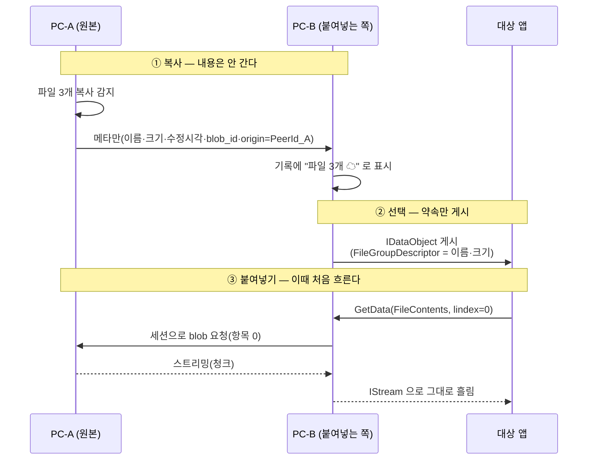

# 26 · 파일 내용 공유 — 붙여넣는 순간 원본 PeerId에서 받아온다 (확장 설계)

> **사용자 요구(2026-08-26)**: *"차후 **파일을 복사 대상으로 전달**하고 **붙여넣기 시에 원 PeerId에서 수신을 받는** 방식으로 파일도 공유되도록 기능 확장하고 싶다. 설계에 반영해줘."*
> *"현재 기준에서는 **동일 `UserId`에서만** 동작하도록 제약할 것."*
>
> **상태**: 📐 **설계만 — 지금 구현하지 않는다**([DR-26](10-decision-record.md) 점증 개발).
> 지금은 [DR-6](10-decision-record.md)대로 **경로 목록만** 전파한다([08 §3](08-clipboard-propagation.md)).
>
> ★ **이건 발명이 아니라 OS가 이미 가진 메커니즘**이다 — Windows **지연 렌더링(가상 파일)** · macOS **파일 약속**.
> RDP·Outlook 첨부·탐색기 zip 내부가 전부 이 규약으로 돈다.

---

## 1. 무엇이 달라지나

| | **지금**([DR-6](10-decision-record.md)) | **확장 후** |
|---|---|---|
| 전파하는 것 | **경로 문자열**(`D:\작업\보고서.xlsx`) | **경로 + 내용 약속**(promise) |
| 상대 PC에서 | ⚠️ 경로가 없으면 **텍스트로 강등**([08 §3-2](08-clipboard-propagation.md#3-2-권장--다적응형--목록-ui에-상태-표시)) | ★ **진짜 파일로 붙여넣어진다** |
| 언제 전송되나 | — | ★ **붙여넣는 순간**(그 전에는 메타만) |
| 대상 | 내 기기 + 남 | ★ **같은 `UserId`(내 기기)만** — [§5](#5-왜-지금은-같은-userid-만인가) |

> ★ **핵심은 "미리 보내지 않는다"** — 붙여넣지 않을 파일을 전송하는 것은 낭비고,
> 클립보드는 **복사한 것의 대부분을 붙여넣지 않는다.**

---

## 2. OS 메커니즘 — 우리는 **제공하는 쪽**이 된다

`nexa-dir2`가 **X-42에서 받는 쪽**을 이미 구현했다(RDP·Outlook·zip에서 오는 가상 파일을 붙여넣기).
우리는 그 **반대편**을 만든다.

| OS | 규약 | 우리가 하는 일 |
|---|---|---|
| **Windows** | `CFSTR_FILEDESCRIPTOR`(`FileGroupDescriptorW` — 항목 목록) + `CFSTR_FILECONTENTS`(`FileContents` — 항목별 `IStream` **지연 스트리밍**) | `IDataObject`를 우리가 게시하고, 붙여넣는 앱이 `GetData(FileContents, lindex)` 를 부르면 **그때 원본 피어에서 스트리밍** |
| **macOS** | `NSFilePromiseProvider` + delegate | 약속만 올리고, 요청이 오면 **임시 위치에 쓰면서** 스트리밍 |
| **Linux/X11** | ✕ **표준 지연 전송이 없다**(`text/uri-list`만) | **임시 파일로 먼저 받아** 경로를 제공(사실상 사전 다운로드) |
| **Linux/Wayland** | 동일 제약 | 동일 |

### 2-1. ★ `nexa-dir2` X-42에서 그대로 가져올 교훈

**같은 규약의 반대편이라 함정도 같다.** dir2가 실기에서 잡은 것들:

| # | 교훈 | 우리에게 |
|:--:|---|---|
| **X-1** | ★ `FileContents`는 **`lindex` 지정**을 요구해 **원시 `GetClipboardData`로는 불가** — `OleGetClipboard` → `IDataObject` 경로여야 한다 | 제공 측도 **`IDataObject` 구현**이 필수(단순 `SetClipboardData`로 안 된다) |
| **X-2** | ★ `FILEDESCRIPTORW`가 **packed 구조체**라 배열 필드 참조가 `E0793` | **값 복사로 우회**(dir2와 같은 처방) |
| **X-3** | ★ **워커화 필수** — dir2는 `CoMarshalInterThreadInterfaceInStream`으로 `IStream`을 워커(MTA)에 넘겨 **UI 펌프 비의존**으로 만들었다 | 우리는 **네트워크에서 읽는다** — UI 스레드에서 하면 **대용량에서 창이 굳는다**. 같은 처방 |
| **X-4** | 항목별 **실패 격리** · 이름 충돌 `" (2)"` · 경로 탈출 기각(`..`·절대·드라이브) | 그대로 필요 — ★ **우리는 이름이 네트워크에서 온다**(더 위험) |

> 👉 **dir2의 X-42 코드가 읽는 쪽 참조 구현으로 그대로 쓸 수 있다** — 포맷 파싱·구조체 정의·워커 패턴이 같다.

---

## 3. 흐름

| 규칙 | 내용 |
|---|---|
| **P-1** | ★ **메타는 즉시, 내용은 붙여넣을 때** — 복사 시점에 전송하지 않는다 |
| **P-2** | ★ **스트리밍한다** — 전체를 메모리에 올리지 않는다(대용량이 예사다) |
| **P-3** | 원본이 이미 로컬에 있으면(같은 PC) **네트워크를 타지 않는다** |
| **P-4** | `blob_id = H(암호문)` 이므로 **이미 받은 적 있으면 재전송이 생략**된다([06 §2-3](06-storage-design.md#2-3-내용-주소-blob--중복-제거가-공짜로-온다)) |
| **P-5** | 진행률·취소를 **붙여넣는 앱이 아니라 우리 UI**가 보여준다(앱은 `IStream`만 안다) |

---

## 4. ⚠️ 이 설계의 급소 — 원본이 꺼져 있으면?

★ **릴레이가 "파이프"인 것과 같은 제약**이다([07 §4-1](07-device-rendezvous.md#4-1-️-릴레이는-버퍼가-아니라-파이프다)) —
**붙여넣는 순간 원본 기기가 켜져 있어야 한다.**

| 상황 | 동작 |
|---|---|
| 원본 온라인 | ✅ 정상 스트리밍 |
| 원본 오프라인 | ⚠️ ★ **붙여넣기 실패** — `IStream`이 에러를 돌려주면 **대상 앱이 조용히 아무것도 안 붙인다** |
| 전송 중 끊김 | 부분 파일이 남는다 → **파편 소거**(dir2 X-42 선례) |

### 4-1. 처방

| # | 처방 | 내용 |
|:--:|---|---|
| **R-1** | ★ **목록에서 미리 알린다** — 원본 오프라인이면 항목에 **`☁ 원본 오프라인`** 배지. 붙여넣기 전에 보인다 |
| **R-2** | ★ **작은 파일은 사전 캐시**(설정 — 예: ≤1MB는 복사 시점에 미리 받아 둠) → 대부분의 실패가 사라진다 |
| **R-3** | 실패 시 **우리 토스트로 사유를 말한다** — 대상 앱은 침묵하므로 우리가 말해야 한다 |
| **R-4** | 고정(핀)한 파일 항목은 **자동 사전 캐시** 후보 |
| **R-5**(2차) | 오프라인 큐(컨텐츠 서버 · [22 I-3](22-upstream-beep-liaison.md))가 생기면 이 제약이 완화된다 |

---

## 5. 왜 지금은 같은 `UserId`만인가

사용자 확정이자 **설계상 타당한 제약**이다.

| # | 이유 |
|:--:|---|
| **①** | ★ **파일은 클립보드 항목보다 위험이 다르다** — 실행 파일·대용량·경로 탈출·이름 위장(RLO). 남에게서 오는 파일은 **무해화 게이트**가 필요하다(`nexa-beep` `nbeep-safe`의 `.beepq` 격리 규약 · [05](05-multi-device-sharing.md) 참조) |
| **②** | **내 기기끼리는 이미 승인이 끝나 있다**([DR-28](10-decision-record.md)) — 항목마다 묻지 않는 전제가 성립한다. 남과는 [DR-22](10-decision-record.md)·[DR-29](10-decision-record.md)의 승인이 붙어야 하고, **파일에는 그것만으로 부족**하다 |
| **③** | ★ **원본 상시 연결 전제**가 내 기기에서는 자연스럽고 남과는 아니다 — 남의 PC가 켜져 있기를 기대하는 UX는 성립하기 어렵다 |
| **④** | [DR-26](10-decision-record.md) 점증 개발 — **되는 범위부터** 낸다 |

> 🔴 **나중에 남에게도 열려면** 무해화 게이트(격리 → 검사 → 승인 → 실체화)가 **선행 조건**이다.
> 그건 파일 공유 기능이 아니라 **보안 기능**이고, 별도 설계가 필요하다 → [D-63](#7-열린-결정).

---

## 6. 요구 등재

| ID | 기능 | 우선 | 비고 |
|---|---|:--:|---|
| **FR-Y-18** | ★ **파일 내용 공유 — 붙여넣는 순간 원본 `PeerId`에서 지연 수신** | **P2**(M3) | 📐 설계만 |
| **FR-Y-19** | ★ **같은 `UserId` 기기 간에만** 동작 | **P2** | 사용자 확정 제약 |
| **FR-Y-20** | 원본 오프라인 시 **목록 배지 + 실패 사유 토스트** | **P2** | R-1·R-3 |
| **FR-Y-21** | **작은 파일 사전 캐시**(크기 상한 설정) | **P2** | R-2 — 실패의 대부분을 없앤다 |
| **✂** | 다른 `UserId`와의 파일 내용 공유 | **✂ 범위 밖** | 무해화 게이트 선행([§5](#5-왜-지금은-같은-userid-만인가)) |

**설정 추가**(구현 시점에 [14](14-settings-registry.md)로): `sync.file_contents`(기본 켬 · 내 기기 한정) · `sync.file_precache_mb`(기본 1).

---

## 7. 열린 결정

| # | 결정할 것 | 선택지 | 권장 |
|---|---|---|---|
| **D-63** | 남과의 파일 공유 개방 | 열지 않음 · **무해화 게이트 선행 후 개방** | ★ 게이트 없이는 열지 않는다 |
| **D-64** | Linux 대응 | 미지원 · **사전 다운로드 후 경로 제공** | ★ 사전 다운로드(지연 전송 표준이 없다) |
| **D-65** | 사전 캐시 기본 상한 | 0(끔) · **1MB** · 10MB | ★ 1MB — 문서·이미지 대부분이 들어온다 |
| **D-66** | 스트리밍 실패 시 부분 파일 | 남김 · ★ **파편 소거** | ★ 소거(dir2 X-42 선례) |
