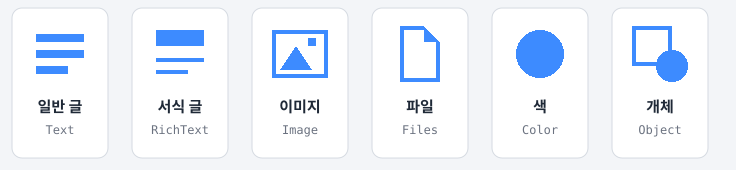
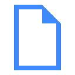
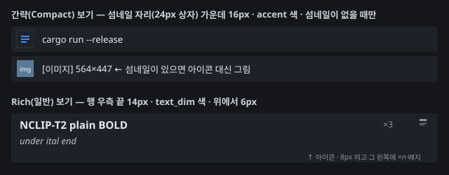

# 34 · 항목 종류 — 일반 글 · 서식 글 · 이미지 · 파일 · 색 · 개체를 가르는 규칙과 아이콘 (사용자 요청 10-04)

> **이 문서는**: 목록에서 종류 아이콘을 보고 *"이게 왜 서식 글로 잡혔나"* 를 알고 싶을 때 보는 **판정 규칙 + 아이콘 모양 일람**이다. 코드 설명서가 아니다.
> **원천(코드)**: 판정 = [`crates/nclip-core/src/capture.rs`](../crates/nclip-core/src/capture.rs) `classify` · `classify_with_text` · 아이콘 = [`crates/nexa-clip/src/kind_icon.rs`](../crates/nexa-clip/src/kind_icon.rs)(10-04 신설).
> **겹치는 문서**(여기 복사하지 않음): OS별 포맷 이름 전반 = [12 §2](12-clipboard-formats.md#2-os별-실제-포맷-이름) · 판정 순서의 설계 이유와 실기 사례 = [27 §1](27-capture-cases.md#1-종류-판정--순서가-전부다) · [27 §8-1~8-3](27-capture-cases.md).

## 1. 종류 일람



| 종류(코드) | 화면 이름 | 아이콘 | 뜻 | 대표 예 |
|---|---|:-:|---|---|
| `Text` | 텍스트 |  같은 굵기 줄 셋 | 서식 없는 맨 글 | 메모장·gedit·터미널에서 복사한 글 |
| `RichText` | 서식 있는 텍스트 |  굵은 제목 줄 + 가는 줄 둘 | 글 + 서식(HTML·RTF) 또는 글이 딸린 앱 고유 형식 | ONLYOFFICE·Word·웹 페이지에서 복사한 글 · Excel 셀 범위 · 글이 있는 PPT 도형 |
| `Image` | 이미지 |  액자 안의 산과 해 | 앱 고유 형식이 없는 순수 그림 | 스크린샷 도구 · 그림판·브라우저 "이미지 복사" |
| `Files` | 파일 |  귀 접힌 종이 | 파일·폴더 경로 목록 | 탐색기 · Finder · Nautilus·Dolphin에서 파일 복사/잘라내기 |
| `Color` | 색상 |  둥근 색 조각 | 색 코드 **한 덩어리만** 있는 평문 | `#1E90FF` · `#abc` · `#1E90FF80` |
| `Object` | 개체 |  네모 테두리 + 겹친 원 | 글이 하나도 없는 앱 고유 개체 — 붙여넣으면 그 앱에서 편집 가능한 도형·차트 | PPT에서 글 없는 도형 복사(`Art::GVML ClipFormat`) |

> 화면 이름은 한국어 UI 기준(`crates/nclip-core/src/i18n.rs` — 영어 Text · Formatted text · Image · Files · Color · Object).

## 2. 판정 규칙 — 위에서부터 처음 걸리는 것

한 번 복사하면 클립보드에는 **같은 내용이 여러 형식(표현)으로** 함께 올라온다(예: 평문 + HTML + 그림). 종류는 **어떤 이름의 표현이 들어 있는가**로만 정하고, 색만 예외로 평문 내용을 본다. **순서가 규칙 전부다** — 위에서 먼저 걸리면 아래는 보지 않는다.

```text
 클립보드 표현 이름들
   │  (곁다리 표현은 없는 셈 친다 — §2-3)
   ▼
 ① 파일 목록 표현이 있나? ───────────── 예 → 파일(Files)
   │ 아니오
 ② HTML 또는 RTF가 있나? ────────────── 예 → 서식 글(RichText)
   │ 아니오
 ③ 앱 고유(벤더) 표현이 있나? ────────── 예 ┬ 평문도 있다 → 서식 글(RichText)
   │ 아니오                                └ 평문 없다   → 개체(Object)
 ④ 비트맵·메타파일(그림)이 있나? ─────── 예 → 이미지(Image)
   │ 아니오
 ⑤ 남은 것 = 평문 ──────────────────────────→ 일반 글(Text)
        └ 평문이 #RGB·#RRGGBB·#RRGGBBAA 하나뿐이면 → 색(Color)
```

| 순서 | 조건 | 결과 | 왜 이 자리인가 |
|:-:|---|---|---|
| ① | 파일 목록 표현 | 파일 | 파일 복사에도 파일 이름이 담긴 평문이 따라온다 — 뒤로 두면 파일 3개가 "텍스트"가 된다 |
| ② | HTML · RTF | 서식 글 | 서식 있는 **글**이 실제로 있다 |
| ③ | 벤더 + 평문 | 서식 글 | Excel 범위 · 글 있는 도형 — 글이 있으니 서식 글 |
| ③ | 벤더만(평문 없음) | 개체 | 글이 없는데 서식 글이라 하면 거짓 · 그림이라 하면 "편집 가능한 도형"임이 가려진다(08-27 실기) |
| ④ | 비트맵 · 메타파일 | 이미지 | ★ 벤더보다 **뒤** — PPT 도형 복사에도 `CF_DIB`가 같이 오기 때문(앞에 두면 도형이 이미지가 됨) |
| ⑤ | 그 밖 | 일반 글 → 색 | 색은 이름이 아니라 **내용**을 봐야 알아서 마지막에 따로 본다. 좁게 잡는다 — `#hashtag`가 든 문장은 색이 아니다 |

### 2-1. "벤더(앱 고유) 표현"이란

**목록으로 알아보지 않는다.** 아래 §2-2의 표준(파일 · HTML · RTF · 비트맵 · 메타파일 · 평문)도 아니고 §2-3의 곁다리도 아니면 전부 벤더다(`is_vendor_format`). `Art::GVML ClipFormat` · `Biff12` · `XML Spreadsheet` 같은 이름을 표로 외우면 앱이 바뀔 때마다 표가 늙기 때문이다 — 이유는 [27 §1](27-capture-cases.md#1-종류-판정--순서가-전부다).

⚠️ 그래서 **처음 보는 이름 하나가 평문 옆에 붙으면 맨 글도 "서식 글"이 된다.** 실제로 그렇게 틀렸던 이름들이 §2-3 곁다리 목록에 들어 있다.

### 2-2. OS별 표현 이름 → 판정 어휘

| 판정 어휘 | Windows | macOS | Linux |
|---|---|---|---|
| **파일 목록** | `CF_HDROP` · `FileGroupDescriptor(W)` · `Shell IDList Array`(잘라내기) | `public.file-url` · `NSFilenamesPboardType` | `text/uri-list` · `x-special/gnome-copied-files` · `x-special/KDE-copied-files` · `x-special/nautilus-clipboard` |
| **HTML** | `HTML Format` · `CF_HTML` | `public.html` | `text/html` |
| **RTF** | `Rich Text Format` · `Rich Text Format Without Objects` | `public.rtf` | `text/rtf` · `application/rtf` |
| **비트맵** | `CF_DIB` · `CF_DIBV5` · `CF_BITMAP` · `PNG` · `JFIF` · `JPEG` · `GIF` | `public.png` · `public.tiff` · `public.jpeg` | `image/png` · `image/bmp` · `image/tiff` · `image/jpeg` · `image/gif` · `image/webp` · `image/svg+xml` |
| **메타파일**(벡터 그림) | `CF_ENHMETAFILE` · `CF_METAFILEPICT` | `com.adobe.pdf` | `application/pdf` |
| **평문** | `CF_UNICODETEXT` · `CF_TEXT` · `CF_OEMTEXT` | `public.utf8-plain-text` | `text/plain`(+ `;charset=…`) |

- 다른 기기에서 온 파일 약속(DR-30 · 09-12)도 파일 목록으로 친다.
- **Linux는 판정 전에 이름을 한 번 정리한다**(`crates/nclip-plat/src/watch_linux.rs`): X11 글자 이름 `UTF8_STRING` · `STRING` · `TEXT`는 모두 `text/plain`으로 모으고, 셀렉션 장치 이름(`TARGETS` · `TIMESTAMP` · `MULTIPLE` · `SAVE_TARGETS` · `DELETE` · `INCR` · `COMPOUND_TEXT` · `CLIPBOARD_MANAGER`)은 읽지 않으며, `;charset=…` 꼬리는 뗀다.

### 2-3. 곁다리 표현 — 없는 셈 친다

내용이 아니라 표식이어서 판정에서 뺀다(`is_metadata_format`). 빼지 않으면 **이것 하나 때문에 맨 글이 서식 글이 된다.**

| 출처 | 이름 |
|---|---|
| Windows 공통·OLE | `CF_LOCALE` · `Object Descriptor` · `Link Source` · `Link Source Descriptor` · `ObjectLink` · `OwnerLink` · `Ole Private Data` · `DataObject` · `CanIncludeInClipboardHistory` · `CanUploadToCloudClipboard` · `ExcludeClipboardContentFromMonitorProcessing` |
| 탐색기 끌기 | `Preferred DropEffect` · `InShellDragLoop` · `DragContext` · `DragImageBits` · `UsingDefaultDragImage` · `IsShowingLayered` · `DragSourceHelperFlags` |
| 브라우저(Chromium) | `Chromium internal source URL` · `Chromium internal source RFH token` · `msSourceUrl` |
| 원격·다른 매니저 | `Terminal Services Private Data` · `application/x-copyq-owner` |
| macOS | `com.apple.cocoa.pasteboard.source-app-id` |
| Linux | `application/x-kde-cutselection` · `application/vnd.portal.files` · `application/vnd.portal.filetransfer` |

> 실기에서 새 곁다리를 만나면 이 목록에 더한다(D-75) — 즉 **"왜 맨 글이 서식 글로 잡혔나"의 1순위 용의자는 처음 보는 곁다리 이름**이다.

### 2-4. 표현이 하나도 없으면

곁다리만 있거나 표현이 0개면 **항목을 만들지 않는다**(`has_content`) — 빈 줄은 고장으로 읽히기 때문이다(Excel 지연 렌더 순간 · rdpclip 08-27 실기).

## 3. 아이콘 모양과 화면 위치

### 3-1. 모양

글꼴 글리프(`▤ ▧ ▣ ▦ ◆ ◇`)는 서로 닮아 구분이 안 돼서, 10-04부터 **도형으로 직접 그린다**(DR-1 — 3-OS 같은 화면 · 글꼴 없어도 안 깨짐). 좌표는 16칸 격자이고 실제 크기(14·16px × 배율)에 맞춰 늘린다. 선 굵기 = 크기의 1/10(최소 1화소).

| 종류 | 그림(16칸 격자 확대) | 기하(격자 칸 · x, y, 폭, 높이) |
|---|:-:|---|
| 일반 글 |  | 같은 굵기(2칸) 줄 셋 — (2,3,12) · (2,7,12) · (2,11,**8**) |
| 서식 글 |  | **굵은 제목**(2,2,12,4) + 가는 줄(굵기 t) 둘 — (2,9,12) · (2,12,8) |
| 이미지 |  | 액자 테두리(1,2,14,12) + 산 삼각형 (3,12)-(7,6)-(11,12) + 해 (10,4,2,2) |
| 파일 |  | 종이 테두리 3~13 × 1~15 · 오른쪽 위 4칸 귀를 접은 삼각형 (9,1)-(9,5)-(13,5) |
| 색 |  | 둥근 조각 (2,2,12,12) · 반지름 6칸 = 사실상 원 |
| 개체 |  | 네모 테두리(1,1,10,10) + 오른쪽 아래에 겹친 원(7,7,8,8 · 반지름 4) |

> ⚠️ **SVG는 근사치다** — `kind_icon.rs`의 기하를 16px 기준(선 굵기 1칸)으로 옮겨 그린 것이고, 실제 화면은 CPU 래스터라이저가 정수 화소로 내림해 그린다(14px에서는 `14×v/16`을 내림 · 선 1화소). 모양·비율은 같지만 화소 단위로는 다를 수 있다. 색 = 시트는 다크 테마 accent `#3D8BFF`.

### 3-2. 어디에 나오나



| 보기 | 자리 | 크기 · 색 | 조건 |
|---|---|---|---|
| **간략(Compact)** — 기본값 | 행 왼쪽 **섬네일 자리**(24px 상자) 가운데 | 16px · accent | 그 항목에 **섬네일이 없을 때만** — 섬네일이 있으면(이미지·그림이 딸린 개체 등) 아이콘 대신 그림 |
| **Rich(일반)** | 행 **우측 끝**(위에서 6px) · 그 왼쪽 8px 띄고 ×n · 배지 | 14px · text_dim | 항상 |
| **한 줄(Plain)** | — | — | 그리지 않는다(밀도 우선) |

- 메인창과 팝업이 같은 함수·같은 자리 규칙을 쓴다(`main_win.rs` · `popup_win.rs`의 `kind_icon::draw` 호출부).
- 목록 경계에 걸쳐 잘린 행에서는 그리지 않는다(도형에 자르기가 없음).
- 위 개념도는 배치 설명용이다 — 실제 행 높이·글꼴과 화소 단위로 같지 않다.

## 4. 자주 헷갈리는 경우

### ① 같은 글인데 "일반 글" 항목과 "서식 글" 항목이 따로 생긴다 (10-04 15차)

- **왜**: 서식 글을 복사하면 처음엔 서식 글로 정상 캡처된다. 그런데 **다른 프로그램이 클립보드를 평문만으로 다시 올리면** 그것도 새 복사로 잡혀 같은 글의 일반 글 항목이 하나 더 생긴다. 실측된 경우 = VMware 클립보드 다리(`vmware-user` · `vmtoolsd -n vmusr`)가 ONLYOFFICE 복사 약 2초 안에 평문만 다시 올림(매번은 아님) · 다른 기기(mac)가 같은 글을 평문으로 되돌려 보냄.
- **지금 동작**(15차 수정): 중복 제외 보기는 같은 글 묶음의 **대표를 핀 > 서식 글 > 로컬 순으로** 고른다 → 서식 항목이 대표로 보이고 그걸 붙인다. 다른 기기에서 받은 항목이 지금 클립보드 맨 앞 서식 글의 평문판이면 **클립보드에 올리지 않는다**(이력에는 남음).
- 이력에 두 항목이 따로 있는 것 자체는 정상이다(같은 글의 두 복사가 각각 기록된 것).

### ② Excel 셀 범위는 "서식 글"이다 (10-04 8~10차)

- Excel 범위 복사 = 평문 + HTML·RTF + `Biff12`·`XML Spreadsheet` 같은 앱 고유 표현 → **② 또는 ③에서 서식 글**. 그림(벡터 `CF_ENHMETAFILE`)이 함께 들어와도 그림 판정(④)까지 내려가지 않는다.
- 그림 표현은 범위가 **행 ≤ 200 · 열 ≤ 50 · 셀 ≤ 5,000**일 때만 받는다 — 행/열 전체나 상한을 넘으면 글·서식만(Windows만 · 그림 상한은 설정 항목으로 빼는 중).
- 그래서 Excel 항목은 서식 글 아이콘이지만 섬네일이 붙을 수 있다(간략 보기에서는 섬네일이 아이콘 자리를 차지).

> 서식(Rich) 보기의 표는 10-05부터 격자 테두리·열 폭 맞춤·칸 채움색으로 그린다(T-63 · 병합 칸·칸 안 줄바꿈은 한계).

### ③ 글 없는 도형은 "개체"다

- PPT에서 글 없는 도형을 복사하면 `Art::GVML ClipFormat`(앱 고유) + PNG·EMF 같은 그림이 함께 온다. 평문이 없으니 ③에서 **개체**.
- "이미지"가 아닌 이유 = 붙여넣으면 PPT에서 편집 가능한 도형으로 돌아가기 때문. 미리보기는 함께 온 그림을 쓴다.
- 같은 도형이라도 **안에 글이 있으면** 평문이 같이 와서 **서식 글**이 된다.

### ④ 파일 관리자 표식이 "일반 글"로 잡히던 문제 (T-55 · 10-04 17차 수정)

- Nautilus 3.x 계열과 VMware 클립보드 다리는 파일 복사를 **평문 내용에** `x-special/nautilus-clipboard` / `copy` / `file://…` 로 싣는다. 판정은 표현 **이름**만 보므로(이름은 `text/plain`) 일반 글이 되고, 그 문자열이 목록에 남았다.
- **수정됨**(10-04 17차 · 3-OS 공통) — 판정 **전에** 평문 내용을 한 번 본다(`promote_nautilus_text`): 첫 줄이 `x-special/nautilus-clipboard`이고 `file://` 줄이 있으면 그 평문 표현을 `x-special/gnome-copied-files`(동사 + URI) + `text/uri-list`로 바꾼다 → §2의 ①에서 **파일**로 판정. 로그 "캡처: 평문에 실린 파일 표식 … 파일 항목으로 올림".
- 첫 줄이 표식이 아니면(예: 문장 중간에 표식 글자가 든 메모) 바꾸지 않는다 — 일반 글 그대로.
- ⚠️ 실기 **미확인**(단위 테스트만).
- 동사가 `cut`(잘라내기)인 파일 항목은 이력에는 남지만 **다른 기기로 전파하지 않는다**(T-53 · [DR-45](10-decision-record.md)).

### ⑤ 글 없이 그림만 든 HTML은 "개체"다 (ONLYOFFICE 프레젠테이션 · 10-04 19차)

- ONLYOFFICE 프레젠테이션은 슬라이드·개체 복사를 **`text/html` 하나로만** 올린다 — 안에 인라인 그림(``)뿐이고 평문·그림 표현이 없다. 이름만 보는 §2에서는 ②의 **서식 글**이 된다.
- 판정 뒤 한 번 더 본다(`tray_cmd.rs` `Shell::html_picture`): HTML에 **글이 없고 인라인 그림뿐이면** 종류를 **개체**로 바꾸고 라벨 "[이미지] W×H" · 그 그림으로 섬네일을 만든다. 개체도 "이미지로 복사"가 된다.
- 개체 여러 개를 복사하면 그림이 여러 장 오는데 원래 배치(위치)는 HTML 태그에 없다 → **원본 배치는 `pptData` 이진의 도형 자리로 복원**(10-04 20차 · 휴리스틱 · 그림 크기와 자리의 배율이 안 맞으면 가로로 나란히 물러남 · T-65 · ✅ 개체 복사 실기 확인됨 10-04).

### ⑥ 그 밖 — 확인 안 된 것

- **ONLYOFFICE 시트**(10-04 18차 실측 · Linux): 표 복사 TARGETS = `STRING` · `UTF8_STRING` · `TEXT` · `text/plain` · `text/plain;charset=utf-8` · `image/png`(2,447B) · `text/html`(9,045B) · 주인 창 이름 "Chromium clipboard" → ②에서 **서식 글**(그림이 함께 있어도 ④까지 안 내려감). 수 초 뒤 VMware 클립보드 다리(`vmware-user`)가 `STRING` · `text/plain` · `UTF8_STRING` · `COMPOUND_TEXT`(31B)로 다시 쥘 수 있다(①의 경우).
- **ONLYOFFICE 문서 편집기**의 서식 표현 이름은 아직 **미확인**이다 — `text/html`이든 다른 앱 고유 이름이든 서식 글로 판정된다(② 또는 ③).
- 브라우저 입력창·Word에서 맨 글을 복사했는데 서식 글로 보이면, 처음 보는 곁다리 이름이 붙었을 가능성이 크다(§2-3). 그 항목의 표현 이름 목록이 원인 확인의 출발점이다.
